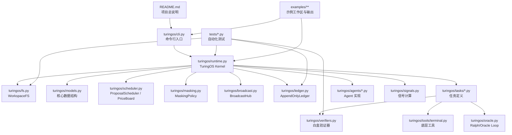

# TuringOS 审计打包文档

本文档为审计用途生成，汇总本仓库中的源码、测试、配置、README 与示例文本文件。
所有代码段均附带审计说明，便于审计师快速识别文件定位与职责。
为避免污染原文，审计说明放在代码块外部，代码内容按原文件逐字收录。

## README

下列内容直接收录项目 `README.md`：

````markdown
# TuringOS

TuringOS 是一个按你给的四篇文章落地的 **Python 参考实现**。它不是“更大的聊天框”，而是一个可运行的 **AI 图灵机操作系统原型**：

- **文件系统 = 纸带**
- **状态寄存器 q = 持久控制状态**
- **当前文件 s + 当前路径 d = 读写头位置**
- **Transition `(q, s, d) -> (q', s', d')` = 单步执行模型**
- **顶层白盒 = 可审计的验证 / 定价 / 广播 / 屏蔽机制**
- **中层黑盒 = 可替换的 worker agent 接口**
- **底层白盒 = 文件、终端、验证器等稳定工具**

这个版本重点做了三件事：

1. 把“长周期图灵机”做成一个真的 runtime。
2. 把“反奥利奥架构”的顶层白盒做成可执行的 signal engine。
3. 把“验证的非对称性”做成 verifier / audit / Ralph loop 三套机制。

## 与四篇文章的对应关系

### 1. 《用图灵机哲学做出一个能通过长周期图灵测试的AI》

对应模块：

- `turingos/runtime.py`：执行循环
- `turingos/fs.py`：文件系统 / 纸带
- `turingos/models.py`：`MachineState`、`Transition`
- `turingos/tasks/parity.py`：把文中的“奇偶校验小游戏”做成可跑 benchmark

### 2. 《群体智慧的架构：反奥利奥理论》

对应模块：

- `turingos/agents/`：中层黑盒 worker
- `turingos/tools/terminal.py`：底层白盒工具
- `turingos/runtime.py`：顶层白盒对中层黑盒的统一调度

### 3. 《验证的非对称性：弱者能不能监管强者》

对应模块：

- `turingos/verifiers.py`：谓词验证器 / 随机抽查验证器
- `turingos/oracle.py`：Ralph loop / 预言机式试错
- `tests/test_oracle.py`、`tests/test_verifiers.py`

### 4. 《反奥利奥架构的AI图灵机 - 顶层的信号控制》

对应模块：

- `turingos/signals.py`：布尔信号、统计信号、price 统计
- `turingos/broadcast.py`：典型错误广播、价格信号广播
- `turingos/masking.py`：细节封装、错误屏蔽、Goodhart 防护
- `turingos/scheduler.py`：选择器与探索/利用平衡

## 目录结构

```text
TuringOS/
├── README.md
├── pyproject.toml
├── turingos/
│   ├── __init__.py
│   ├── agents/
│   │   ├── base.py
│   │   └── parity.py
│   ├── tasks/
│   │   ├── base.py
│   │   └── parity.py
│   ├── tools/
│   │   └── terminal.py
│   ├── broadcast.py
│   ├── cli.py
│   ├── fs.py
│   ├── ledger.py
│   ├── masking.py
│   ├── models.py
│   ├── oracle.py
│   ├── runtime.py
│   ├── scheduler.py
│   ├── signals.py
│   └── verifiers.py
└── tests/
```

## 核心设计

### 1. AI 图灵机内核

核心状态：

```python
MachineState(
    step: int,
    current_path: str,
    register: dict,
    halted: bool,
)
```

核心步进：

```python
Transition(
    next_register: dict,
    next_path: str,
    write_mode: "keep" | "overwrite",
    write_content: str | None,
    halt: bool,
)
```

执行循环：

1. 读取当前路径 `d` 的内容 `s`
2. 给多个 worker agent 分发被屏蔽后的上下文
3. 收集候选 transition
4. 用顶层白盒 verifier 量化成信号
5. 用 scheduler 选择一个 proposal
6. 提交到文件系统并写入 append-only ledger

### 2. 顶层白盒只做“pricing”，不做“valuation”

内核不会用另一个黑盒去“理解哪个方案更优雅”。
它只做：

- 格式 / 路径 / 写入权限检查
- 任务级硬谓词检查
- 错误类型计数
- agent price 统计
- 典型错误广播

### 3. 选择性广播与屏蔽

给 agent 的上下文里：

- **有**：自己的最近错误、公开的典型错误、粗粒度 price hint
- **没有**：其他 agent 的原始 proposal、完整评分公式、底层内部账本

这对应文章里的：

- 广播典型错误
- 广播价格信号
- 屏蔽错误传播
- 屏蔽相关性
- 屏蔽 Goodhart

### 4. 不可篡改历史

`ledger.jsonl` 用 hash-chain 追加写入，每一步都会记录：

- 当前路径与内容
- 选中的 agent
- 选中的 transition
- 当步信号
- 当步 price 排名

可用 `verify_integrity()` 验证是否被篡改。

## 运行示例

### 1. 运行 parity demo

```bash
python -m turingos.cli parity-demo --workspace ./examples/parity_workspace --clean
```

这个 demo 会：

- 建一个含 `.ls` 文件的目录树
- 初始化 `parity.md`
- 让多 agent 在白盒验证器约束下完成遍历
- 最后把 `odd/even` 写入 `result.md`

### 2. 运行 Ralph loop demo

```bash
python -m turingos.cli oracle-demo --target 17
```

## 测试

```bash
python -m pytest
```

## 当前实现边界

这个仓库已经是可运行工程，不是伪代码；但我刻意把“中层黑盒”做成了**可插拔接口**，而不是强绑定某个在线模型 API。原因很简单：当前运行环境里没有外部模型服务。

所以这版交付是：

- **内核 / verifier / signal / runtime / ledger / masking / scheduler：完整可运行**
- **中层黑盒：提供脚本化 agent 与 noisy agent，接口已经抽象好，可直接替换成真实 LLM adapter**

如果你后续要接真实模型，只要实现 `Agent.propose(view) -> AgentProposal` 即可。
````

## 项目拓扑图

下图展示项目主要模块之间的关系，聚焦运行时内核、任务、agent、验证器、账本与测试层。



## 项目目录树

```text
./.pytest_cache/.gitignore
./.pytest_cache/CACHEDIR.TAG
./.pytest_cache/README.md
./PROJECT_TREE.txt
./README.md
./examples/parity_demo_output.json
./examples/parity_workspace/.ls
./examples/parity_workspace/32342323.md
./examples/parity_workspace/ledger.jsonl
./examples/parity_workspace/parity.md
./examples/parity_workspace/result.md
./pyproject.toml
./tests/__pycache__/conftest.cpython-313-pytest-9.0.2.pyc
./tests/__pycache__/test_fs.cpython-313-pytest-9.0.2.pyc
./tests/__pycache__/test_ledger.cpython-313-pytest-9.0.2.pyc
./tests/__pycache__/test_masking_and_scheduler.cpython-313-pytest-9.0.2.pyc
./tests/__pycache__/test_oracle.cpython-313-pytest-9.0.2.pyc
./tests/__pycache__/test_parity_runtime.cpython-313-pytest-9.0.2.pyc
./tests/__pycache__/test_terminal_tool.cpython-313-pytest-9.0.2.pyc
./tests/__pycache__/test_verifiers.cpython-313-pytest-9.0.2.pyc
./tests/conftest.py
./tests/pytest_output.txt
./tests/test_fs.py
./tests/test_ledger.py
./tests/test_masking_and_scheduler.py
./tests/test_oracle.py
./tests/test_parity_runtime.py
./tests/test_terminal_tool.py
./tests/test_verifiers.py
./turingos/__init__.py
./turingos/__pycache__/__init__.cpython-313.pyc
./turingos/__pycache__/broadcast.cpython-313.pyc
./turingos/__pycache__/cli.cpython-313.pyc
./turingos/__pycache__/fs.cpython-313.pyc
./turingos/__pycache__/ledger.cpython-313.pyc
./turingos/__pycache__/masking.cpython-313.pyc
./turingos/__pycache__/models.cpython-313.pyc
./turingos/__pycache__/oracle.cpython-313.pyc
./turingos/__pycache__/runtime.cpython-313.pyc
./turingos/__pycache__/scheduler.cpython-313.pyc
./turingos/__pycache__/signals.cpython-313.pyc
./turingos/__pycache__/verifiers.cpython-313.pyc
./turingos/agents/__init__.py
./turingos/agents/base.py
./turingos/agents/parity.py
./turingos/broadcast.py
./turingos/cli.py
./turingos/fs.py
./turingos/ledger.py
./turingos/masking.py
./turingos/models.py
./turingos/oracle.py
./turingos/runtime.py
./turingos/scheduler.py
./turingos/signals.py
./turingos/tasks/__init__.py
./turingos/tasks/base.py
./turingos/tasks/parity.py
./turingos/tools/__init__.py
./turingos/tools/terminal.py
./turingos/verifiers.py
```

## 收录范围

- 审计文档生成时间：2026-03-08T09:48:08
- 收录文件总数：46
- 排除内容：`.git/`、`__pycache__/`、`.pyc`、`.DS_Store`、`audit/` 下已生成文件

## 文件逐项汇编

### `README.md`

> 审计说明：该文件是 `README.md`。用途：项目总说明文档，介绍设计目标、架构映射、运行方式和实现边界。

````markdown
# TuringOS

TuringOS 是一个按你给的四篇文章落地的 **Python 参考实现**。它不是“更大的聊天框”，而是一个可运行的 **AI 图灵机操作系统原型**：

- **文件系统 = 纸带**
- **状态寄存器 q = 持久控制状态**
- **当前文件 s + 当前路径 d = 读写头位置**
- **Transition `(q, s, d) -> (q', s', d')` = 单步执行模型**
- **顶层白盒 = 可审计的验证 / 定价 / 广播 / 屏蔽机制**
- **中层黑盒 = 可替换的 worker agent 接口**
- **底层白盒 = 文件、终端、验证器等稳定工具**

这个版本重点做了三件事：

1. 把“长周期图灵机”做成一个真的 runtime。
2. 把“反奥利奥架构”的顶层白盒做成可执行的 signal engine。
3. 把“验证的非对称性”做成 verifier / audit / Ralph loop 三套机制。

## 与四篇文章的对应关系

### 1. 《用图灵机哲学做出一个能通过长周期图灵测试的AI》

对应模块：

- `turingos/runtime.py`：执行循环
- `turingos/fs.py`：文件系统 / 纸带
- `turingos/models.py`：`MachineState`、`Transition`
- `turingos/tasks/parity.py`：把文中的“奇偶校验小游戏”做成可跑 benchmark

### 2. 《群体智慧的架构：反奥利奥理论》

对应模块：

- `turingos/agents/`：中层黑盒 worker
- `turingos/tools/terminal.py`：底层白盒工具
- `turingos/runtime.py`：顶层白盒对中层黑盒的统一调度

### 3. 《验证的非对称性：弱者能不能监管强者》

对应模块：

- `turingos/verifiers.py`：谓词验证器 / 随机抽查验证器
- `turingos/oracle.py`：Ralph loop / 预言机式试错
- `tests/test_oracle.py`、`tests/test_verifiers.py`

### 4. 《反奥利奥架构的AI图灵机 - 顶层的信号控制》

对应模块：

- `turingos/signals.py`：布尔信号、统计信号、price 统计
- `turingos/broadcast.py`：典型错误广播、价格信号广播
- `turingos/masking.py`：细节封装、错误屏蔽、Goodhart 防护
- `turingos/scheduler.py`：选择器与探索/利用平衡

## 目录结构

```text
TuringOS/
├── README.md
├── pyproject.toml
├── turingos/
│   ├── __init__.py
│   ├── agents/
│   │   ├── base.py
│   │   └── parity.py
│   ├── tasks/
│   │   ├── base.py
│   │   └── parity.py
│   ├── tools/
│   │   └── terminal.py
│   ├── broadcast.py
│   ├── cli.py
│   ├── fs.py
│   ├── ledger.py
│   ├── masking.py
│   ├── models.py
│   ├── oracle.py
│   ├── runtime.py
│   ├── scheduler.py
│   ├── signals.py
│   └── verifiers.py
└── tests/
```

## 核心设计

### 1. AI 图灵机内核

核心状态：

```python
MachineState(
    step: int,
    current_path: str,
    register: dict,
    halted: bool,
)
```

核心步进：

```python
Transition(
    next_register: dict,
    next_path: str,
    write_mode: "keep" | "overwrite",
    write_content: str | None,
    halt: bool,
)
```

执行循环：

1. 读取当前路径 `d` 的内容 `s`
2. 给多个 worker agent 分发被屏蔽后的上下文
3. 收集候选 transition
4. 用顶层白盒 verifier 量化成信号
5. 用 scheduler 选择一个 proposal
6. 提交到文件系统并写入 append-only ledger

### 2. 顶层白盒只做“pricing”，不做“valuation”

内核不会用另一个黑盒去“理解哪个方案更优雅”。
它只做：

- 格式 / 路径 / 写入权限检查
- 任务级硬谓词检查
- 错误类型计数
- agent price 统计
- 典型错误广播

### 3. 选择性广播与屏蔽

给 agent 的上下文里：

- **有**：自己的最近错误、公开的典型错误、粗粒度 price hint
- **没有**：其他 agent 的原始 proposal、完整评分公式、底层内部账本

这对应文章里的：

- 广播典型错误
- 广播价格信号
- 屏蔽错误传播
- 屏蔽相关性
- 屏蔽 Goodhart

### 4. 不可篡改历史

`ledger.jsonl` 用 hash-chain 追加写入，每一步都会记录：

- 当前路径与内容
- 选中的 agent
- 选中的 transition
- 当步信号
- 当步 price 排名

可用 `verify_integrity()` 验证是否被篡改。

## 运行示例

### 1. 运行 parity demo

```bash
python -m turingos.cli parity-demo --workspace ./examples/parity_workspace --clean
```

这个 demo 会：

- 建一个含 `.ls` 文件的目录树
- 初始化 `parity.md`
- 让多 agent 在白盒验证器约束下完成遍历
- 最后把 `odd/even` 写入 `result.md`

### 2. 运行 Ralph loop demo

```bash
python -m turingos.cli oracle-demo --target 17
```

## 测试

```bash
python -m pytest
```

## 当前实现边界

这个仓库已经是可运行工程，不是伪代码；但我刻意把“中层黑盒”做成了**可插拔接口**，而不是强绑定某个在线模型 API。原因很简单：当前运行环境里没有外部模型服务。

所以这版交付是：

- **内核 / verifier / signal / runtime / ledger / masking / scheduler：完整可运行**
- **中层黑盒：提供脚本化 agent 与 noisy agent，接口已经抽象好，可直接替换成真实 LLM adapter**

如果你后续要接真实模型，只要实现 `Agent.propose(view) -> AgentProposal` 即可。
````

### `PROJECT_TREE.txt`

> 审计说明：该文件是 `PROJECT_TREE.txt`。用途：项目目录树快照，用于快速展示仓库层级和文件分布。

```text
./.pytest_cache/.gitignore
./.pytest_cache/CACHEDIR.TAG
./.pytest_cache/README.md
./PROJECT_TREE.txt
./README.md
./examples/parity_demo_output.json
./examples/parity_workspace/.ls
./examples/parity_workspace/32342323.md
./examples/parity_workspace/ledger.jsonl
./examples/parity_workspace/parity.md
./examples/parity_workspace/result.md
./pyproject.toml
./tests/__pycache__/conftest.cpython-313-pytest-9.0.2.pyc
./tests/__pycache__/test_fs.cpython-313-pytest-9.0.2.pyc
./tests/__pycache__/test_ledger.cpython-313-pytest-9.0.2.pyc
./tests/__pycache__/test_masking_and_scheduler.cpython-313-pytest-9.0.2.pyc
./tests/__pycache__/test_oracle.cpython-313-pytest-9.0.2.pyc
./tests/__pycache__/test_parity_runtime.cpython-313-pytest-9.0.2.pyc
./tests/__pycache__/test_terminal_tool.cpython-313-pytest-9.0.2.pyc
./tests/__pycache__/test_verifiers.cpython-313-pytest-9.0.2.pyc
./tests/conftest.py
./tests/pytest_output.txt
./tests/test_fs.py
./tests/test_ledger.py
./tests/test_masking_and_scheduler.py
./tests/test_oracle.py
./tests/test_parity_runtime.py
./tests/test_terminal_tool.py
./tests/test_verifiers.py
./turingos/__init__.py
./turingos/__pycache__/__init__.cpython-313.pyc
./turingos/__pycache__/broadcast.cpython-313.pyc
./turingos/__pycache__/cli.cpython-313.pyc
./turingos/__pycache__/fs.cpython-313.pyc
./turingos/__pycache__/ledger.cpython-313.pyc
./turingos/__pycache__/masking.cpython-313.pyc
./turingos/__pycache__/models.cpython-313.pyc
./turingos/__pycache__/oracle.cpython-313.pyc
./turingos/__pycache__/runtime.cpython-313.pyc
./turingos/__pycache__/scheduler.cpython-313.pyc
./turingos/__pycache__/signals.cpython-313.pyc
./turingos/__pycache__/verifiers.cpython-313.pyc
./turingos/agents/__init__.py
./turingos/agents/base.py
./turingos/agents/parity.py
./turingos/broadcast.py
./turingos/cli.py
./turingos/fs.py
./turingos/ledger.py
./turingos/masking.py
./turingos/models.py
./turingos/oracle.py
./turingos/runtime.py
./turingos/scheduler.py
./turingos/signals.py
./turingos/tasks/__init__.py
./turingos/tasks/base.py
./turingos/tasks/parity.py
./turingos/tools/__init__.py
./turingos/tools/terminal.py
./turingos/verifiers.py
```

### `pyproject.toml`

> 审计说明：该文件是 `pyproject.toml`。用途：Python 项目配置文件，定义包元数据、依赖和测试/构建入口。

```toml
[build-system]
requires = ["setuptools>=68", "wheel"]
build-backend = "setuptools.build_meta"

[project]
name = "turingos"
version = "0.1.0"
description = "A reference implementation of an AI Turing Machine OS with white-box control and black-box workers."
readme = "README.md"
requires-python = ">=3.11"
authors = [
  { name = "OpenAI ChatGPT" }
]
dependencies = []

[project.optional-dependencies]
dev = ["pytest>=8.0"]

[tool.setuptools]
package-dir = {"" = "."}

[tool.setuptools.packages.find]
where = ["."]
include = ["turingos*"]

[tool.pytest.ini_options]
addopts = "-q"
testpaths = ["tests"]
```

### `.gitignore`

> 审计说明：该文件是 `.gitignore`。用途：Git 忽略规则配置，声明不纳入版本控制的文件与目录。

```text
.DS_Store
__pycache__/
.pytest_cache/
*.py[cod]
```

### `turingos/__init__.py`

> 审计说明：该文件是 `turingos/__init__.py`。用途：包导出入口，统一暴露核心数据结构和运行时对象。

```python
"""TuringOS: a reference architecture for a long-cycle AI Turing machine."""

from .models import (
    AgentProposal,
    AgentView,
    EvaluatedProposal,
    MachineState,
    RunResult,
    SignalBundle,
    Transition,
)
from .runtime import TuringOSKernel, TuringOSConfig

__all__ = [
    "AgentProposal",
    "AgentView",
    "EvaluatedProposal",
    "MachineState",
    "RunResult",
    "SignalBundle",
    "Transition",
    "TuringOSKernel",
    "TuringOSConfig",
]
```

### `turingos/agents/__init__.py`

> 审计说明：该文件是 `turingos/agents/__init__.py`。用途：agent 子包导出入口。

```python
from .base import Agent
from .parity import DeterministicPolicyAgent, NoisyPolicyAgent

__all__ = ["Agent", "DeterministicPolicyAgent", "NoisyPolicyAgent"]
```

### `turingos/agents/base.py`

> 审计说明：该文件是 `turingos/agents/base.py`。用途：agent 抽象基类，定义统一的提案接口。

```python
from __future__ import annotations

from typing import Protocol

from ..models import AgentProposal, AgentView


class Agent(Protocol):
    agent_id: str

    def propose(self, view: AgentView) -> AgentProposal:
        ...
```

### `turingos/agents/parity.py`

> 审计说明：该文件是 `turingos/agents/parity.py`。用途：示例 parity agent，实现目录遍历与奇偶判断任务的提案逻辑。

```python
from __future__ import annotations

import copy
import random
from dataclasses import dataclass, field
from typing import Callable

from ..models import AgentProposal, AgentView, Transition


PolicyFn = Callable[[AgentView], Transition]


@dataclass(slots=True)
class DeterministicPolicyAgent:
    agent_id: str
    policy: PolicyFn

    def propose(self, view: AgentView) -> AgentProposal:
        transition = self.policy(view)
        return AgentProposal(
            agent_id=self.agent_id,
            transition=transition,
            raw_response=f"policy phase={view.state.register.get('phase')}",
        )


@dataclass(slots=True)
class NoisyPolicyAgent:
    agent_id: str
    policy: PolicyFn
    error_rate: float = 0.25
    rng: random.Random = field(default_factory=random.Random)

    def _mutate(self, transition: Transition) -> Transition:
        t = copy.deepcopy(transition)
        choice = self.rng.choice(["path", "write_mode", "write_content", "register", "halt"])
        if choice == "path":
            # stay in place or jump to a wrong but in-bounds path.
            t.next_path = ".ls" if t.next_path != ".ls" else "parity.md"
        elif choice == "write_mode":
            t.write_mode = "overwrite" if t.write_mode == "keep" else "keep"
            if t.write_mode == "keep":
                t.write_content = None
            elif t.write_content is None:
                t.write_content = "garbage"
        elif choice == "write_content":
            if t.write_mode == "keep":
                t.write_mode = "overwrite"
            current = t.write_content or "0"
            t.write_content = "1" if current != "1" else "0"
        elif choice == "register":
            reg = copy.deepcopy(t.next_register)
            reg["phase"] = "scan" if reg.get("phase") != "scan" else "finalize"
            t.next_register = reg
        elif choice == "halt":
            t.halt = not t.halt
        return t

    def propose(self, view: AgentView) -> AgentProposal:
        transition = self.policy(view)
        if self.rng.random() < self.error_rate:
            transition = self._mutate(transition)
            raw = f"noisy phase={view.state.register.get('phase')} mutated"
        else:
            raw = f"noisy phase={view.state.register.get('phase')} exact"
        return AgentProposal(agent_id=self.agent_id, transition=transition, raw_response=raw)
```

### `turingos/broadcast.py`

> 审计说明：该文件是 `turingos/broadcast.py`。用途：广播模块，负责把典型错误和价格信号对 agent 进行选择性公开。

```python
from __future__ import annotations

from collections import Counter, defaultdict, deque
from dataclasses import dataclass, field


@dataclass(slots=True)
class BroadcastHub:
    """Top-level white-box signal broadcaster.

    Public broadcasts contain only coarse error categories and price-like summaries.
    Private feedback is agent-local and may be more specific.
    """

    public_errors: Counter[str] = field(default_factory=Counter)
    public_messages: dict[str, str] = field(default_factory=dict)
    private_feedback: dict[str, deque[str]] = field(default_factory=lambda: defaultdict(lambda: deque(maxlen=6)))
    public_price_messages: deque[str] = field(default_factory=lambda: deque(maxlen=8))
    threshold: int = 2

    def record_private(self, agent_id: str, message: str) -> None:
        if not message:
            return
        self.private_feedback[agent_id].append(message)

    def record_public_error(self, fingerprint: str, message: str) -> None:
        if not fingerprint:
            return
        self.public_errors[fingerprint] += 1
        if message:
            self.public_messages[fingerprint] = message

    def maybe_publish_typical_errors(self) -> list[str]:
        published: list[str] = []
        for fingerprint, count in self.public_errors.items():
            if count >= self.threshold and fingerprint in self.public_messages:
                published.append(self.public_messages[fingerprint])
        return sorted(set(published))

    def publish_price_summary(self, summary: str) -> None:
        if summary:
            self.public_price_messages.append(summary)

    def visible_to(self, agent_id: str) -> tuple[list[str], list[str]]:
        public = self.maybe_publish_typical_errors() + list(self.public_price_messages)
        private = list(self.private_feedback.get(agent_id, []))
        return public[-8:], private[-4:]
```

### `turingos/cli.py`

> 审计说明：该文件是 `turingos/cli.py`。用途：命令行入口，提供 demo 和实验运行命令。

```python
from __future__ import annotations

import argparse
import json
import random
import shutil
from pathlib import Path

from .agents.parity import DeterministicPolicyAgent, NoisyPolicyAgent
from .models import AgentView
from .oracle import RalphLoop
from .runtime import TuringOSConfig, TuringOSKernel
from .tasks.parity import ParityTask


def _parity_policy(task: ParityTask, kernel_fs):
    def policy(view: AgentView):
        return task.expected_transition(view.state, view.current_content, kernel_fs)

    return policy


def run_parity_demo(args: argparse.Namespace) -> int:
    workspace = Path(args.workspace)
    if workspace.exists() and args.clean:
        shutil.rmtree(workspace)
    task = ParityTask()
    config = TuringOSConfig(max_steps=args.max_steps, explore_epsilon=args.epsilon, random_seed=args.seed)
    # Initialize kernel first so the workspace exists for the policy closure.
    kernel = TuringOSKernel(workspace_root=workspace, task=task, agents=[], config=config)
    policy = _parity_policy(task, kernel.fs)
    agents = [DeterministicPolicyAgent(agent_id="alpha", policy=policy)]
    for i in range(args.noisy_agents):
        agents.append(
            NoisyPolicyAgent(
                agent_id=f"noise-{i+1}",
                policy=policy,
                error_rate=args.error_rate,
                rng=random.Random(args.seed + i + 1),
            )
        )
    kernel.agents = agents
    result = kernel.run()
    payload = {
        "success": result.success,
        "steps": result.steps_executed,
        "selected_agents": result.selected_agents,
        "diagnostics": result.diagnostics,
    }
    print(json.dumps(payload, ensure_ascii=False, indent=2))
    return 0 if result.success else 1


def run_oracle_demo(args: argparse.Namespace) -> int:
    target = args.target
    loop = RalphLoop[int](max_attempts=args.max_attempts, rng=random.Random(args.seed))

    def generator(rng: random.Random) -> int:
        # biased around the answer but still stochastic
        return max(0, int(rng.gauss(target, args.stddev)))

    def verifier(candidate: int) -> bool:
        return candidate == target

    result = loop.solve(generator, verifier)
    print(json.dumps({"accepted": result.accepted, "attempts": result.attempts, "candidate": result.candidate}, ensure_ascii=False, indent=2))
    return 0 if result.accepted else 1


def build_parser() -> argparse.ArgumentParser:
    parser = argparse.ArgumentParser(description="TuringOS demo CLI")
    sub = parser.add_subparsers(dest="cmd", required=True)

    parity = sub.add_parser("parity-demo", help="run the article parity task")
    parity.add_argument("--workspace", default="./examples/parity_workspace")
    parity.add_argument("--max-steps", type=int, default=64)
    parity.add_argument("--epsilon", type=float, default=0.0)
    parity.add_argument("--seed", type=int, default=7)
    parity.add_argument("--noisy-agents", type=int, default=3)
    parity.add_argument("--error-rate", type=float, default=0.35)
    parity.add_argument("--clean", action="store_true")
    parity.set_defaults(func=run_parity_demo)

    oracle = sub.add_parser("oracle-demo", help="run a tiny Ralph-loop demo")
    oracle.add_argument("--target", type=int, default=17)
    oracle.add_argument("--max-attempts", type=int, default=64)
    oracle.add_argument("--stddev", type=float, default=5.0)
    oracle.add_argument("--seed", type=int, default=7)
    oracle.set_defaults(func=run_oracle_demo)

    return parser


def main() -> int:
    parser = build_parser()
    args = parser.parse_args()
    return args.func(args)


if __name__ == "__main__":  # pragma: no cover
    raise SystemExit(main())
```

### `turingos/fs.py`

> 审计说明：该文件是 `turingos/fs.py`。用途：工作区文件系统抽象，把目录和文件读写包装成图灵机纸带接口。

```python
from __future__ import annotations

import hashlib
import os
from dataclasses import dataclass
from pathlib import Path
from typing import Iterable


class PathEscapeError(ValueError):
    pass


@dataclass(slots=True)
class WorkspaceFS:
    root: Path
    protected_filenames: set[str] | None = None
    hidden_listing_names: set[str] | None = None

    def __post_init__(self) -> None:
        self.root = self.root.resolve()
        self.root.mkdir(parents=True, exist_ok=True)
        if self.protected_filenames is None:
            self.protected_filenames = {".ls"}
        if self.hidden_listing_names is None:
            self.hidden_listing_names = {".ls", "parity.md", "result.md", "ledger.jsonl"}

    def resolve(self, rel_path: str) -> Path:
        if rel_path.startswith("/"):
            candidate = (self.root / rel_path.removeprefix("/")).resolve()
        else:
            candidate = (self.root / rel_path).resolve()
        try:
            candidate.relative_to(self.root)
        except ValueError as exc:
            raise PathEscapeError(f"path escapes workspace: {rel_path}") from exc
        return candidate

    def rel(self, rel_path: str) -> str:
        resolved = self.resolve(rel_path)
        return resolved.relative_to(self.root).as_posix()

    def exists(self, rel_path: str) -> bool:
        return self.resolve(rel_path).exists()

    def is_dir(self, rel_path: str) -> bool:
        return self.resolve(rel_path).is_dir()

    def read_text(self, rel_path: str, default: str = "") -> str:
        path = self.resolve(rel_path)
        if not path.exists():
            return default
        return path.read_text(encoding="utf-8")

    def write_text(self, rel_path: str, content: str) -> None:
        path = self.resolve(rel_path)
        path.parent.mkdir(parents=True, exist_ok=True)
        path.write_text(content, encoding="utf-8")

    def mkdir(self, rel_path: str) -> None:
        self.resolve(rel_path).mkdir(parents=True, exist_ok=True)

    def list_dir(self, rel_path: str = ".") -> list[str]:
        path = self.resolve(rel_path)
        if not path.exists() or not path.is_dir():
            return []
        return sorted(p.name for p in path.iterdir())

    def generate_ls_files(self) -> None:
        for dirpath, dirnames, filenames in os.walk(self.root):
            dirnames[:] = sorted(dirnames)
            filenames = sorted(filenames)
            rel_dir = Path(dirpath).resolve().relative_to(self.root).as_posix()
            if rel_dir == ".":
                rel_dir = ""
            lines: list[str] = []
            for name in dirnames:
                if name.startswith("."):
                    continue
                lines.append(f"DIR {name}")
            for name in filenames:
                if name in self.hidden_listing_names or name.startswith("."):
                    continue
                lines.append(f"FILE {name}")
            listing = "\n".join(lines)
            target = (Path(rel_dir) / ".ls").as_posix() if rel_dir else ".ls"
            self.write_text(target, listing)

    def walk_files(self, suffix: str | None = None) -> list[str]:
        files: list[str] = []
        for path in self.root.rglob("*"):
            if not path.is_file():
                continue
            rel = path.relative_to(self.root).as_posix()
            if suffix and not rel.endswith(suffix):
                continue
            files.append(rel)
        return sorted(files)

    def search(self, pattern: str, suffix: str | None = None) -> list[str]:
        results: list[str] = []
        for rel in self.walk_files(suffix=suffix):
            if pattern in self.read_text(rel):
                results.append(rel)
        return results

    def file_digest(self, rel_path: str) -> str:
        content = self.read_text(rel_path)
        return hashlib.sha256(content.encode("utf-8")).hexdigest()

    def tree_digests(self, include_hidden: bool = False) -> dict[str, str]:
        digests: dict[str, str] = {}
        for rel in self.walk_files():
            if not include_hidden and Path(rel).name.startswith("."):
                continue
            digests[rel] = self.file_digest(rel)
        return digests

    def snapshot(self, include_hidden: bool = False) -> dict[str, str]:
        snapshot: dict[str, str] = {}
        for rel in self.walk_files():
            if not include_hidden and Path(rel).name.startswith("."):
                continue
            snapshot[rel] = self.read_text(rel)
        return snapshot

    def is_protected(self, rel_path: str) -> bool:
        return Path(rel_path).name in (self.protected_filenames or set())

    def ensure_paths(self, paths: Iterable[str]) -> None:
        for rel in paths:
            self.resolve(rel)
```

### `turingos/ledger.py`

> 审计说明：该文件是 `turingos/ledger.py`。用途：追加式账本实现，记录每一步执行并做完整性校验。

```python
from __future__ import annotations

import hashlib
import json
from dataclasses import dataclass
from pathlib import Path
from typing import Any


@dataclass(slots=True)
class AppendOnlyLedger:
    path: Path

    def __post_init__(self) -> None:
        self.path.parent.mkdir(parents=True, exist_ok=True)
        if not self.path.exists():
            self.path.write_text("", encoding="utf-8")

    def _line_hash(self, payload: dict[str, Any], previous_hash: str) -> str:
        canonical = json.dumps(payload, ensure_ascii=False, sort_keys=True, separators=(",", ":"))
        material = f"{previous_hash}:{canonical}".encode("utf-8")
        return hashlib.sha256(material).hexdigest()

    def append(self, payload: dict[str, Any]) -> dict[str, Any]:
        records = self.records()
        previous_hash = records[-1]["hash"] if records else "GENESIS"
        record = {
            "previous_hash": previous_hash,
            "payload": payload,
        }
        record["hash"] = self._line_hash(payload, previous_hash)
        with self.path.open("a", encoding="utf-8") as fh:
            fh.write(json.dumps(record, ensure_ascii=False, sort_keys=True) + "\n")
        return record

    def records(self) -> list[dict[str, Any]]:
        content = self.path.read_text(encoding="utf-8")
        records: list[dict[str, Any]] = []
        for line in content.splitlines():
            if not line.strip():
                continue
            records.append(json.loads(line))
        return records

    def verify_integrity(self) -> bool:
        previous_hash = "GENESIS"
        for record in self.records():
            payload = record.get("payload")
            expected = self._line_hash(payload, previous_hash)
            if record.get("previous_hash") != previous_hash:
                return False
            if record.get("hash") != expected:
                return False
            previous_hash = record["hash"]
        return True
```

### `turingos/masking.py`

> 审计说明：该文件是 `turingos/masking.py`。用途：上下文屏蔽策略，决定 agent 能看到哪些公开/私有信号。

```python
from __future__ import annotations

from dataclasses import dataclass
from typing import Iterable

from .models import AgentView, MachineState
from .signals import PriceStats


@dataclass(slots=True)
class MaskingPolicy:
    max_public_messages: int = 6
    max_private_messages: int = 3

    def price_hint(self, stats: PriceStats | None) -> str:
        if stats is None or stats.attempts < 2:
            return "neutral"
        if stats.price >= 0.8:
            return "high"
        if stats.price >= 0.4:
            return "medium"
        return "low"

    def build_view(
        self,
        *,
        agent_id: str,
        state: MachineState,
        current_content: str,
        public_messages: Iterable[str],
        private_messages: Iterable[str],
        price_stats: PriceStats | None,
    ) -> AgentView:
        # Deliberately omit other agents' proposals and the raw scoring formula.
        return AgentView(
            agent_id=agent_id,
            state=state,
            current_content=current_content,
            public_broadcasts=list(public_messages)[-self.max_public_messages :],
            private_feedback=list(private_messages)[-self.max_private_messages :],
            price_hint=self.price_hint(price_stats),
        )
```

### `turingos/models.py`

> 审计说明：该文件是 `turingos/models.py`。用途：核心数据模型定义，包括状态、转移、proposal、运行结果等。

```python
from __future__ import annotations

from dataclasses import dataclass, field
from typing import Any, Literal

WriteMode = Literal["keep", "overwrite"]


@dataclass(slots=True)
class MachineState:
    """Persistent kernel state q plus the current head path d."""

    step: int
    current_path: str
    register: dict[str, Any]
    halted: bool = False

    def clone(self) -> "MachineState":
        return MachineState(
            step=self.step,
            current_path=self.current_path,
            register={**self.register},
            halted=self.halted,
        )


@dataclass(slots=True)
class Transition:
    """One AI-Turing-machine step: (q, s, d) -> (q', s', d')."""

    next_register: dict[str, Any]
    next_path: str
    write_mode: WriteMode = "keep"
    write_content: str | None = None
    halt: bool = False
    notes: str = ""

    def normalized(self) -> "Transition":
        if self.write_mode == "keep":
            return Transition(
                next_register=self.next_register,
                next_path=self.next_path,
                write_mode="keep",
                write_content=None,
                halt=self.halt,
                notes=self.notes,
            )
        return self


@dataclass(slots=True)
class AgentView:
    """Masked context visible to a worker."""

    agent_id: str
    state: MachineState
    current_content: str
    public_broadcasts: list[str] = field(default_factory=list)
    private_feedback: list[str] = field(default_factory=list)
    price_hint: str = "neutral"


@dataclass(slots=True)
class AgentProposal:
    agent_id: str
    transition: Transition
    raw_response: str = ""


@dataclass(slots=True)
class SignalBundle:
    hard_pass: bool
    score: float = 0.0
    hard_fail_reasons: list[str] = field(default_factory=list)
    score_components: dict[str, float] = field(default_factory=dict)
    public_feedback: list[str] = field(default_factory=list)
    private_feedback: list[str] = field(default_factory=list)
    error_fingerprints: list[str] = field(default_factory=list)

    @property
    def utility(self) -> float:
        if not self.hard_pass:
            return float("-inf")
        return self.score


@dataclass(slots=True)
class EvaluatedProposal:
    proposal: AgentProposal
    signals: SignalBundle
    scheduler_score: float = 0.0

    @property
    def agent_id(self) -> str:
        return self.proposal.agent_id

    @property
    def transition(self) -> Transition:
        return self.proposal.transition


@dataclass(slots=True)
class RunResult:
    state: MachineState
    final_files: dict[str, str]
    steps_executed: int
    selected_agents: list[str]
    success: bool
    diagnostics: dict[str, Any] = field(default_factory=dict)
```

### `turingos/oracle.py`

> 审计说明：该文件是 `turingos/oracle.py`。用途：Oracle/Ralph loop 试错模块，用于反复尝试直到满足验证条件。

```python
from __future__ import annotations

import random
from dataclasses import dataclass, field
from typing import Callable, Generic, TypeVar

T = TypeVar("T")


@dataclass(slots=True)
class RalphLoopResult(Generic[T]):
    candidate: T | None
    attempts: int
    accepted: bool


@dataclass(slots=True)
class RalphLoop(Generic[T]):
    """T2-style solve loop: cheap verifier, many candidate attempts."""

    max_attempts: int = 128
    rng: random.Random = field(default_factory=random.Random)

    def solve(
        self,
        generator: Callable[[random.Random], T],
        verifier: Callable[[T], bool],
    ) -> RalphLoopResult[T]:
        for attempt in range(1, self.max_attempts + 1):
            candidate = generator(self.rng)
            if verifier(candidate):
                return RalphLoopResult(candidate=candidate, attempts=attempt, accepted=True)
        return RalphLoopResult(candidate=None, attempts=self.max_attempts, accepted=False)
```

### `turingos/runtime.py`

> 审计说明：该文件是 `turingos/runtime.py`。用途：运行时内核，负责调度 agent、验证 proposal、落盘状态和账本。

```python
from __future__ import annotations

import json
import random
from dataclasses import dataclass, field
from pathlib import Path
from typing import Iterable

from .broadcast import BroadcastHub
from .fs import WorkspaceFS
from .ledger import AppendOnlyLedger
from .masking import MaskingPolicy
from .models import EvaluatedProposal, MachineState, RunResult
from .scheduler import PriceBoard, ProposalScheduler
from .tasks.base import Task


@dataclass(slots=True)
class TuringOSConfig:
    max_steps: int = 128
    explore_epsilon: float = 0.05
    random_seed: int = 0
    ledger_filename: str = "ledger.jsonl"
    abort_on_no_valid_proposal: bool = True


@dataclass(slots=True)
class TuringOSKernel:
    workspace_root: Path
    task: Task
    agents: list
    config: TuringOSConfig = field(default_factory=TuringOSConfig)
    fs: WorkspaceFS | None = None
    state: MachineState | None = None
    board: PriceBoard = field(default_factory=PriceBoard)
    broadcasts: BroadcastHub = field(default_factory=BroadcastHub)
    masking: MaskingPolicy = field(default_factory=MaskingPolicy)
    scheduler: ProposalScheduler | None = None
    ledger: AppendOnlyLedger | None = None
    selected_agents: list[str] = field(default_factory=list)

    def __post_init__(self) -> None:
        if self.fs is None:
            self.fs = WorkspaceFS(Path(self.workspace_root))
        if self.scheduler is None:
            self.scheduler = ProposalScheduler(epsilon=self.config.explore_epsilon, rng=random.Random(self.config.random_seed))
        if self.ledger is None:
            self.ledger = AppendOnlyLedger(Path(self.workspace_root) / self.config.ledger_filename)
        self.task.setup(self.fs)
        if self.state is None:
            self.state = self.task.initial_state()

    def _agent_view(self, agent_id: str):
        assert self.state is not None
        assert self.fs is not None
        current_content = self.fs.read_text(self.state.current_path)
        public_messages, private_messages = self.broadcasts.visible_to(agent_id)
        return self.masking.build_view(
            agent_id=agent_id,
            state=self.state,
            current_content=current_content,
            public_messages=public_messages,
            private_messages=private_messages,
            price_stats=self.board.stats.get(agent_id),
        )

    def _evaluate_proposals(self) -> list[EvaluatedProposal]:
        assert self.state is not None
        assert self.fs is not None
        current_content = self.fs.read_text(self.state.current_path)
        evaluated: list[EvaluatedProposal] = []
        for agent in self.agents:
            view = self._agent_view(agent.agent_id)
            proposal = agent.propose(view)
            signals = self.task.verify_proposal(self.state, current_content, proposal.transition, self.fs)
            evaluated.append(EvaluatedProposal(proposal=proposal, signals=signals))
        return evaluated

    def _record_feedback(self, evaluated: list[EvaluatedProposal], chosen: EvaluatedProposal) -> None:
        for candidate in evaluated:
            for msg in candidate.signals.private_feedback:
                self.broadcasts.record_private(candidate.agent_id, msg)
            public_msg = candidate.signals.public_feedback[0] if candidate.signals.public_feedback else ""
            for fingerprint in candidate.signals.error_fingerprints:
                self.broadcasts.record_public_error(fingerprint, public_msg)

            accepted = candidate is chosen and candidate.signals.hard_pass
            reward = candidate.signals.score if accepted else (candidate.signals.score * 0.25 if candidate.signals.hard_pass else candidate.signals.score)
            self.board.update(candidate.agent_id, accepted=accepted, reward=reward)

        ranking = self.board.ranking()[:3]
        if ranking:
            summary = "price 排名：" + " > ".join(agent_id for agent_id, _ in ranking)
            self.broadcasts.publish_price_summary(summary)

    def _apply(self, chosen: EvaluatedProposal) -> None:
        assert self.state is not None
        assert self.fs is not None
        assert self.ledger is not None

        current_path = self.state.current_path
        current_content = self.fs.read_text(current_path)
        transition = chosen.transition.normalized()

        if transition.write_mode == "overwrite":
            self.fs.write_text(current_path, transition.write_content or "")
            self.fs.generate_ls_files()

        next_state = MachineState(
            step=self.state.step + 1,
            current_path=transition.next_path,
            register=transition.next_register,
            halted=transition.halt,
        )
        self.selected_agents.append(chosen.agent_id)

        self.ledger.append(
            {
                "step": self.state.step,
                "selected_agent": chosen.agent_id,
                "current_path": current_path,
                "current_content": current_content,
                "transition": {
                    "next_path": transition.next_path,
                    "write_mode": transition.write_mode,
                    "write_content": transition.write_content,
                    "halt": transition.halt,
                    "next_register": transition.next_register,
                },
                "signals": {
                    "hard_pass": chosen.signals.hard_pass,
                    "score": chosen.signals.score,
                    "score_components": chosen.signals.score_components,
                },
                "price_ranking": self.board.ranking()[:5],
            }
        )
        self.state = next_state

    def step_once(self) -> None:
        assert self.state is not None
        evaluated = self._evaluate_proposals()
        chosen = self.scheduler.select(evaluated, self.board)
        if self.config.abort_on_no_valid_proposal and not chosen.signals.hard_pass:
            reasons = "; ".join(chosen.signals.hard_fail_reasons)
            raise RuntimeError(f"no valid proposal at step {self.state.step}: {reasons}")
        self._record_feedback(evaluated, chosen)
        self._apply(chosen)

    def run(self) -> RunResult:
        assert self.state is not None
        assert self.fs is not None
        for _ in range(self.config.max_steps):
            if self.state.halted:
                break
            self.step_once()
            if self.task.is_success(self.state, self.fs):
                break

        success = self.task.is_success(self.state, self.fs)
        return RunResult(
            state=self.state,
            final_files=self.fs.snapshot(include_hidden=False),
            steps_executed=self.state.step,
            selected_agents=list(self.selected_agents),
            success=success,
            diagnostics={
                "task": self.task.diagnostics(self.fs),
                "ledger_ok": self.ledger.verify_integrity() if self.ledger else False,
                "price_ranking": self.board.ranking(),
                "public_broadcasts": self.broadcasts.maybe_publish_typical_errors(),
            },
        )

    def dump_run(self, path: Path) -> None:
        result = self.run()
        payload = {
            "success": result.success,
            "steps": result.steps_executed,
            "state": {
                "step": result.state.step,
                "current_path": result.state.current_path,
                "register": result.state.register,
                "halted": result.state.halted,
            },
            "selected_agents": result.selected_agents,
            "diagnostics": result.diagnostics,
        }
        path.write_text(json.dumps(payload, ensure_ascii=False, indent=2), encoding="utf-8")
```

### `turingos/scheduler.py`

> 审计说明：该文件是 `turingos/scheduler.py`。用途：提案调度与价格板实现，在探索和利用之间做选择。

```python
from __future__ import annotations

import random
from dataclasses import dataclass, field

from .models import EvaluatedProposal
from .signals import PriceStats


@dataclass(slots=True)
class PriceBoard:
    stats: dict[str, PriceStats] = field(default_factory=dict)

    def get(self, agent_id: str) -> PriceStats:
        if agent_id not in self.stats:
            self.stats[agent_id] = PriceStats()
        return self.stats[agent_id]

    def update(self, agent_id: str, *, accepted: bool, reward: float) -> None:
        s = self.get(agent_id)
        s.attempts += 1
        if accepted:
            s.accepts += 1
        s.total_reward += reward
        s.last_reward = reward

    def ranking(self) -> list[tuple[str, float]]:
        return sorted(((agent_id, stat.price) for agent_id, stat in self.stats.items()), key=lambda x: x[1], reverse=True)


@dataclass(slots=True)
class ProposalScheduler:
    epsilon: float = 0.1
    rng: random.Random = field(default_factory=random.Random)

    def scheduler_score(self, proposal: EvaluatedProposal, prior_price: float) -> float:
        if not proposal.signals.hard_pass:
            return float("-inf")
        return proposal.signals.score + prior_price

    def select(self, proposals: list[EvaluatedProposal], board: PriceBoard) -> EvaluatedProposal:
        valid = [p for p in proposals if p.signals.hard_pass]
        if not valid:
            # all failed. choose the least-bad proposal to preserve diagnostics.
            return max(proposals, key=lambda p: p.signals.score)

        for proposal in valid:
            prior = board.get(proposal.agent_id).price
            proposal.scheduler_score = self.scheduler_score(proposal, prior)

        if self.epsilon > 0 and self.rng.random() < self.epsilon:
            return self.rng.choice(valid)
        return max(valid, key=lambda p: p.scheduler_score)
```

### `turingos/signals.py`

> 审计说明：该文件是 `turingos/signals.py`。用途：信号计算模块，负责统计 proposal 的硬约束和软得分。

```python
from __future__ import annotations

from collections import Counter
from dataclasses import dataclass, field
from statistics import mean
from typing import Iterable


@dataclass(slots=True)
class PriceStats:
    attempts: int = 0
    accepts: int = 0
    total_reward: float = 0.0
    last_reward: float = 0.0

    @property
    def acceptance_rate(self) -> float:
        return self.accepts / self.attempts if self.attempts else 0.0

    @property
    def mean_reward(self) -> float:
        return self.total_reward / self.attempts if self.attempts else 0.0

    @property
    def price(self) -> float:
        # simple white-box pricing: reward for successful outcomes, not for reasons.
        return (self.acceptance_rate * 0.6) + (self.mean_reward * 0.4)


@dataclass(slots=True)
class ConsensusSignal:
    counts: Counter[str] = field(default_factory=Counter)

    @classmethod
    def from_answers(cls, answers: Iterable[str]) -> "ConsensusSignal":
        return cls(counts=Counter(answers))

    def majority_answer(self) -> str | None:
        if not self.counts:
            return None
        return self.counts.most_common(1)[0][0]

    def majority_strength(self) -> float:
        total = sum(self.counts.values())
        if total == 0:
            return 0.0
        _, c = self.counts.most_common(1)[0]
        return c / total


@dataclass(slots=True)
class StatisticalSignal:
    values: list[float]

    def mean(self) -> float:
        return mean(self.values) if self.values else 0.0

    def variance(self) -> float:
        if not self.values:
            return 0.0
        m = self.mean()
        return sum((v - m) ** 2 for v in self.values) / len(self.values)
```

### `turingos/tasks/__init__.py`

> 审计说明：该文件是 `turingos/tasks/__init__.py`。用途：task 子包导出入口。

```python
from .base import Task
from .parity import ParityTask

__all__ = ["Task", "ParityTask"]
```

### `turingos/tasks/base.py`

> 审计说明：该文件是 `turingos/tasks/base.py`。用途：任务抽象基类，定义初始化、验证和终止条件接口。

```python
from __future__ import annotations

from typing import Protocol

from ..fs import WorkspaceFS
from ..models import MachineState, SignalBundle, Transition


class Task(Protocol):
    name: str

    def setup(self, fs: WorkspaceFS) -> None:
        ...

    def initial_state(self) -> MachineState:
        ...

    def expected_transition(self, state: MachineState, current_content: str, fs: WorkspaceFS) -> Transition:
        ...

    def verify_proposal(self, state: MachineState, current_content: str, proposal: Transition, fs: WorkspaceFS) -> SignalBundle:
        ...

    def is_success(self, state: MachineState, fs: WorkspaceFS) -> bool:
        ...

    def diagnostics(self, fs: WorkspaceFS) -> dict:
        ...
```

### `turingos/tasks/parity.py`

> 审计说明：该文件是 `turingos/tasks/parity.py`。用途：parity 示例任务，构建工作区并定义奇偶校验业务规则。

```python
from __future__ import annotations

import copy
from dataclasses import dataclass, field
from pathlib import PurePosixPath
from typing import Any

from ..fs import WorkspaceFS
from ..models import MachineState, SignalBundle, Transition


def _join(base: str, name: str) -> str:
    if not base or base == ".":
        return name
    return f"{base}/{name}"


def _dir_of(path: str) -> str:
    parent = str(PurePosixPath(path).parent)
    return "" if parent == "." else parent


def _parse_listing(content: str) -> tuple[list[str], list[str]]:
    dirs: list[str] = []
    files: list[str] = []
    for raw in content.splitlines():
        line = raw.strip()
        if not line:
            continue
        kind, _, name = line.partition(" ")
        if kind == "DIR":
            dirs.append(name)
        elif kind == "FILE":
            files.append(name)
    return dirs, files


@dataclass(slots=True)
class ParityTask:
    """Filesystem parity task from the article, wrapped as a deterministic benchmark."""

    tree: dict[str, Any] = field(default_factory=dict)
    name: str = "parity"
    parity_path: str = "parity.md"
    result_path: str = "result.md"
    expected_answer: str = ""

    def __post_init__(self) -> None:
        if not self.tree:
            self.tree = {
                "32342323.md": "32342323",
                "1": {"100.md": "100"},
                "2": {"200.md": "200"},
                "3": {"300.md": "300"},
                "4": {},
            }

    def setup(self, fs: WorkspaceFS) -> None:
        self._materialize_tree(fs, self.tree)
        fs.generate_ls_files()
        self.expected_answer = self._compute_expected_answer(fs)

    def _materialize_tree(self, fs: WorkspaceFS, tree: dict[str, Any], base: str = "") -> None:
        for name, value in tree.items():
            rel = _join(base, name)
            if isinstance(value, dict):
                fs.mkdir(rel)
                self._materialize_tree(fs, value, rel)
            else:
                fs.write_text(rel, str(value))

    def _numeric_files(self, fs: WorkspaceFS) -> list[str]:
        files = []
        for rel in fs.walk_files(suffix=".md"):
            name = PurePosixPath(rel).name
            if name in {self.parity_path, self.result_path}:
                continue
            files.append(rel)
        return sorted(files)

    def _compute_expected_answer(self, fs: WorkspaceFS) -> str:
        parity = 0
        for rel in self._numeric_files(fs):
            value = int(fs.read_text(rel).strip())
            parity ^= (value & 1)
        return "odd" if parity else "even"

    def initial_state(self) -> MachineState:
        return MachineState(
            step=0,
            current_path=".ls",
            register={
                "phase": "boot",
                "todo": [],
                "pending": None,
                "answer": None,
                "completed": [],
                "files": {
                    "parity": self.parity_path,
                    "result": self.result_path,
                    "root_listing": ".ls",
                },
            },
            halted=False,
        )

    def _completed(self, reg: dict[str, Any], path: str) -> dict[str, Any]:
        new_reg = copy.deepcopy(reg)
        completed = list(new_reg.get("completed", []))
        if path not in completed:
            completed.append(path)
        new_reg["completed"] = completed
        return new_reg

    def _dedupe_preserve(self, items: list[str], completed: list[str]) -> list[str]:
        seen = set(completed)
        output: list[str] = []
        for item in items:
            if item in seen:
                continue
            if item in output:
                continue
            output.append(item)
        return output

    def expected_transition(self, state: MachineState, current_content: str, fs: WorkspaceFS) -> Transition:
        reg = copy.deepcopy(state.register)
        phase = reg.get("phase")
        todo = list(reg.get("todo", []))
        pending = reg.get("pending")
        parity_path = reg["files"]["parity"]
        result_path = reg["files"]["result"]
        current_path = state.current_path

        if phase == "boot":
            reg["phase"] = "init_parity"
            return Transition(next_register=reg, next_path=parity_path, write_mode="keep")

        if phase == "init_parity":
            reg["phase"] = "scan"
            reg["todo"] = []
            return Transition(
                next_register=reg,
                next_path=reg["files"]["root_listing"],
                write_mode="overwrite",
                write_content="0",
            )

        if phase == "scan":
            if current_path.endswith(".ls"):
                dirs, files = _parse_listing(current_content)
                base_dir = _dir_of(current_path)
                discovered_files = [_join(base_dir, name) for name in files if name.endswith(".md")]
                discovered_dirs = [_join(_join(base_dir, name), ".ls") for name in dirs]
                remaining = [item for item in todo if item != current_path]
                completed = list(reg.get("completed", []))
                if current_path not in completed:
                    completed.append(current_path)
                reg["completed"] = completed
                reg["todo"] = self._dedupe_preserve(remaining + discovered_files + discovered_dirs, completed)
                if reg["todo"]:
                    return Transition(next_register=reg, next_path=reg["todo"][0], write_mode="keep")
                reg["phase"] = "finalize"
                return Transition(next_register=reg, next_path=parity_path, write_mode="keep")

            if current_path.endswith(".md") and PurePosixPath(current_path).name not in {self.parity_path, self.result_path}:
                value = int(current_content.strip())
                bit = value & 1
                remaining = [item for item in todo if item != current_path]
                reg = self._completed(reg, current_path)
                reg["todo"] = remaining
                reg["pending"] = {"bit": bit, "source": current_path}
                reg["phase"] = "apply_pending"
                return Transition(next_register=reg, next_path=parity_path, write_mode="keep")

            # defensive fallback: route back to first todo or finalize.
            if todo:
                return Transition(next_register=reg, next_path=todo[0], write_mode="keep")
            reg["phase"] = "finalize"
            return Transition(next_register=reg, next_path=parity_path, write_mode="keep")

        if phase == "apply_pending":
            bit = int((pending or {}).get("bit", 0))
            current = int((current_content or "0").strip() or "0")
            new_value = str(current ^ bit)
            reg["pending"] = None
            if reg.get("todo"):
                reg["phase"] = "scan"
                next_path = reg["todo"][0]
            else:
                reg["phase"] = "finalize"
                next_path = parity_path
            return Transition(next_register=reg, next_path=next_path, write_mode="overwrite", write_content=new_value)

        if phase == "finalize":
            if current_path != parity_path:
                return Transition(next_register=reg, next_path=parity_path, write_mode="keep")
            answer = "odd" if int((current_content or "0").strip() or "0") else "even"
            reg["answer"] = answer
            reg["phase"] = "write_result"
            return Transition(next_register=reg, next_path=result_path, write_mode="keep")

        if phase == "write_result":
            if current_path != result_path:
                return Transition(next_register=reg, next_path=result_path, write_mode="keep")
            reg["phase"] = "halt"
            return Transition(
                next_register=reg,
                next_path=result_path,
                write_mode="overwrite",
                write_content=str(reg.get("answer") or self.expected_answer),
                halt=True,
            )

        if phase == "halt":
            return Transition(next_register=reg, next_path=current_path, write_mode="keep", halt=True)

        raise ValueError(f"unknown phase: {phase}")

    def verify_proposal(self, state: MachineState, current_content: str, proposal: Transition, fs: WorkspaceFS) -> SignalBundle:
        expected = self.expected_transition(state, current_content, fs)
        mismatches: list[str] = []
        public: list[str] = []
        private: list[str] = []

        def add(kind: str, detail: str) -> None:
            mismatches.append(f"{kind}:{detail}")

        if proposal.next_path != expected.next_path:
            add("wrong_path", f"expected next_path={expected.next_path}, got {proposal.next_path}")
            public.append("典型错误：读写头移动到了错误路径。")

        if proposal.write_mode != expected.write_mode:
            add("wrong_write_mode", f"expected write_mode={expected.write_mode}, got {proposal.write_mode}")
            public.append("典型错误：写入模式不符合协议。")

        if (proposal.write_content or "") != (expected.write_content or ""):
            add(
                "wrong_write_content",
                f"expected write_content={expected.write_content!r}, got {proposal.write_content!r}",
            )
            public.append("典型错误：写入内容与白盒规则不一致。")

        if proposal.halt != expected.halt:
            add("wrong_halt", f"expected halt={expected.halt}, got {proposal.halt}")
            public.append("典型错误：停机判定错误。")

        if proposal.next_register != expected.next_register:
            add("wrong_register", "next_register diverged from expected policy")
            public.append("典型错误：状态寄存器 q' 漂移。")

        # Generic boundary checks.
        try:
            fs.resolve(proposal.next_path)
        except Exception as exc:
            add("path_escape", str(exc))
            public.append("典型错误：访问越界路径。")

        if fs.is_protected(state.current_path) and proposal.write_mode != "keep":
            add("write_protected", f"attempted to write protected file {state.current_path}")
            public.append("典型错误：试图写入受保护文件。")

        if not mismatches:
            progress = len(expected.next_register.get("completed", [])) / max(1, len(self._numeric_files(fs)) + len(fs.search("DIR", suffix=".ls")) + 1)
            return SignalBundle(
                hard_pass=True,
                score=1.0 + progress,
                score_components={"exact_match": 1.0, "progress": progress},
                public_feedback=[],
                private_feedback=[],
                error_fingerprints=[],
            )

        private.extend(mismatches)
        fingerprints = [m.split(":", 1)[0] for m in mismatches]
        return SignalBundle(
            hard_pass=False,
            score=-float(len(mismatches)),
            hard_fail_reasons=mismatches,
            public_feedback=sorted(set(public)),
            private_feedback=private,
            error_fingerprints=sorted(set(fingerprints)),
        )

    def is_success(self, state: MachineState, fs: WorkspaceFS) -> bool:
        if not state.halted:
            return False
        result = fs.read_text(self.result_path).strip()
        return result == self.expected_answer

    def diagnostics(self, fs: WorkspaceFS) -> dict:
        return {
            "expected_answer": self.expected_answer or self._compute_expected_answer(fs),
            "numeric_files": self._numeric_files(fs),
            "result": fs.read_text(self.result_path).strip(),
            "parity": fs.read_text(self.parity_path).strip(),
        }
```

### `turingos/tools/__init__.py`

> 审计说明：该文件是 `turingos/tools/__init__.py`。用途：工具子包导出入口。

```python
from .terminal import UnsafeCommandError, WhitelistedTerminalTool

__all__ = ["UnsafeCommandError", "WhitelistedTerminalTool"]
```

### `turingos/tools/terminal.py`

> 审计说明：该文件是 `turingos/tools/terminal.py`。用途：终端工具封装，向 agent 或运行时提供受控命令执行能力。

```python
from __future__ import annotations

import shlex
import subprocess
from dataclasses import dataclass, field
from pathlib import Path


class UnsafeCommandError(ValueError):
    pass


@dataclass(slots=True)
class WhitelistedTerminalTool:
    workspace_root: Path
    allowed_commands: set[str] = field(default_factory=lambda: {"ls", "cat", "pwd", "echo", "touch", "mkdir"})

    def run(self, command: str) -> subprocess.CompletedProcess[str]:
        argv = shlex.split(command)
        if not argv:
            raise UnsafeCommandError("empty command")
        if argv[0] not in self.allowed_commands:
            raise UnsafeCommandError(f"command not allowed: {argv[0]}")
        for token in argv[1:]:
            if token in {";", "&&", "||", "|", ">", ">>", "<", "$(", "`"}:
                raise UnsafeCommandError("shell metacharacters are not allowed")
            if token.startswith("/"):
                raise UnsafeCommandError("absolute paths are not allowed")
            if ".." in token.split("/"):
                raise UnsafeCommandError("path traversal is not allowed")
        return subprocess.run(
            argv,
            cwd=str(self.workspace_root),
            text=True,
            capture_output=True,
            check=False,
        )
```

### `turingos/verifiers.py`

> 审计说明：该文件是 `turingos/verifiers.py`。用途：验证器集合，提供谓词验证和抽查验证等白盒校验能力。

```python
from __future__ import annotations

import random
from dataclasses import dataclass, field
from typing import Callable, Iterable, Sequence

from .models import SignalBundle

Predicate = Callable[[object], tuple[bool, str, str]]
AuditSlot = tuple[str, str]


@dataclass(slots=True)
class PredicateVerifier:
    predicates: Sequence[Predicate]

    def verify(self, value: object) -> SignalBundle:
        reasons: list[str] = []
        private: list[str] = []
        public: list[str] = []
        for predicate in self.predicates:
            ok, public_msg, private_msg = predicate(value)
            if not ok:
                reasons.append(private_msg or public_msg or predicate.__name__)
                if public_msg:
                    public.append(public_msg)
                if private_msg:
                    private.append(private_msg)
        return SignalBundle(
            hard_pass=not reasons,
            score=1.0 if not reasons else -float(len(reasons)),
            hard_fail_reasons=reasons,
            public_feedback=public,
            private_feedback=private,
            error_fingerprints=[reason.split(":", 1)[0] for reason in reasons],
        )


@dataclass(slots=True)
class RandomAuditVerifier:
    """T5-style verifier: sample random local slots to catch hidden errors."""

    sample_size: int
    rng: random.Random = field(default_factory=random.Random)

    def audit(
        self,
        slots: Sequence[AuditSlot],
        checker: Callable[[AuditSlot], bool],
    ) -> SignalBundle:
        if not slots:
            return SignalBundle(hard_pass=True, score=1.0)
        size = min(self.sample_size, len(slots))
        sampled = self.rng.sample(list(slots), size)
        failures: list[str] = []
        for slot in sampled:
            if not checker(slot):
                failures.append(slot[0])
        return SignalBundle(
            hard_pass=not failures,
            score=1.0 if not failures else -float(len(failures)),
            hard_fail_reasons=[f"audit:{name}" for name in failures],
            public_feedback=["典型错误：随机抽查发现局部证据不一致。"] if failures else [],
            private_feedback=[f"audit failed at {name}" for name in failures],
            error_fingerprints=["audit_mismatch"] if failures else [],
        )


@dataclass(slots=True)
class ExactTransitionVerifier:
    """Demo helper: accept iff the transition equals the expected white-box policy."""

    comparator: Callable[[object, object], tuple[bool, str | None]]

    def verify(self, expected: object, actual: object) -> SignalBundle:
        ok, detail = self.comparator(expected, actual)
        if ok:
            return SignalBundle(hard_pass=True, score=1.0, score_components={"exact": 1.0})
        msg = detail or "transition_mismatch"
        return SignalBundle(
            hard_pass=False,
            score=-1.0,
            hard_fail_reasons=[msg],
            public_feedback=["典型错误：提案与白盒策略不一致。"],
            private_feedback=[msg],
            error_fingerprints=[msg.split(":", 1)[0]],
        )
```

### `tests/conftest.py`

> 审计说明：该文件是 `tests/conftest.py`。用途：pytest 公共夹具与测试初始化逻辑。

```python
from __future__ import annotations

import random
from pathlib import Path

import pytest

from turingos.agents.parity import DeterministicPolicyAgent, NoisyPolicyAgent
from turingos.models import AgentView
from turingos.runtime import TuringOSConfig, TuringOSKernel
from turingos.tasks.parity import ParityTask


@pytest.fixture()
def parity_kernel_factory(tmp_path: Path):
    def make(*, noisy_agents: int = 0, error_rate: float = 0.35, epsilon: float = 0.0, seed: int = 7):
        task = ParityTask()
        config = TuringOSConfig(max_steps=64, explore_epsilon=epsilon, random_seed=seed)
        kernel = TuringOSKernel(workspace_root=tmp_path / f"ws_{seed}_{noisy_agents}", task=task, agents=[], config=config)

        def policy(view: AgentView):
            return task.expected_transition(view.state, view.current_content, kernel.fs)

        agents = [DeterministicPolicyAgent(agent_id="alpha", policy=policy)]
        for i in range(noisy_agents):
            agents.append(
                NoisyPolicyAgent(
                    agent_id=f"noise-{i+1}",
                    policy=policy,
                    error_rate=error_rate,
                    rng=random.Random(seed + i + 1),
                )
            )
        kernel.agents = agents
        return kernel

    return make
```

### `tests/pytest_output.txt`

> 审计说明：该文件是 `tests/pytest_output.txt`。用途：测试输出样例，作为一次 pytest 运行结果留档。

```text
............                                                             [100%]
```

### `tests/test_fs.py`

> 审计说明：该文件是 `tests/test_fs.py`。用途：文件系统抽象测试，验证工作区读写和目录行为。

```python
from __future__ import annotations

from pathlib import Path

import pytest

from turingos.fs import PathEscapeError, WorkspaceFS


def test_workspace_fs_roundtrip_and_ls_generation(tmp_path: Path) -> None:
    fs = WorkspaceFS(tmp_path)
    fs.mkdir("a")
    fs.write_text("a/1.md", "1")
    fs.write_text("root.md", "42")
    fs.generate_ls_files()

    assert fs.read_text("a/1.md") == "1"
    assert "FILE root.md" in fs.read_text(".ls")
    assert "FILE 1.md" in fs.read_text("a/.ls")
    assert sorted(fs.walk_files(suffix=".md")) == ["a/1.md", "root.md"]


def test_workspace_fs_blocks_escape(tmp_path: Path) -> None:
    fs = WorkspaceFS(tmp_path)
    with pytest.raises(PathEscapeError):
        fs.resolve("../outside.txt")
```

### `tests/test_ledger.py`

> 审计说明：该文件是 `tests/test_ledger.py`。用途：账本测试，验证追加记录和完整性校验。

```python
from __future__ import annotations

from pathlib import Path

from turingos.ledger import AppendOnlyLedger


def test_append_only_ledger_detects_tamper(tmp_path: Path) -> None:
    ledger = AppendOnlyLedger(tmp_path / "ledger.jsonl")
    ledger.append({"step": 1, "value": "a"})
    ledger.append({"step": 2, "value": "b"})
    assert ledger.verify_integrity() is True

    content = (tmp_path / "ledger.jsonl").read_text(encoding="utf-8")
    (tmp_path / "ledger.jsonl").write_text(content.replace('"b"', '"evil"'), encoding="utf-8")
    assert ledger.verify_integrity() is False
```

### `tests/test_masking_and_scheduler.py`

> 审计说明：该文件是 `tests/test_masking_and_scheduler.py`。用途：屏蔽策略与调度器测试，验证信号可见性和选择策略。

```python
from __future__ import annotations

import random

from turingos.masking import MaskingPolicy
from turingos.models import AgentProposal, EvaluatedProposal, MachineState, SignalBundle, Transition
from turingos.scheduler import PriceBoard, ProposalScheduler
from turingos.signals import PriceStats


def test_masking_policy_hides_raw_formula_and_peers() -> None:
    masking = MaskingPolicy(max_public_messages=2, max_private_messages=2)
    state = MachineState(step=1, current_path="x.md", register={"phase": "scan"})
    view = masking.build_view(
        agent_id="a",
        state=state,
        current_content="123",
        public_messages=["typical error 1", "typical error 2", "typical error 3"],
        private_messages=["own error 1", "own error 2", "own error 3"],
        price_stats=PriceStats(attempts=10, accepts=9, total_reward=8.0),
    )
    assert view.public_broadcasts == ["typical error 2", "typical error 3"]
    assert view.private_feedback == ["own error 2", "own error 3"]
    assert view.price_hint == "high"
    assert not hasattr(view, "peer_proposals")
    assert not hasattr(view, "scoring_formula")


def test_scheduler_prefers_higher_utility_with_price_prior() -> None:
    board = PriceBoard()
    board.update("low", accepted=True, reward=0.1)
    for _ in range(5):
        board.update("high", accepted=True, reward=2.0)

    low = EvaluatedProposal(
        proposal=AgentProposal("low", Transition(next_register={}, next_path="a")),
        signals=SignalBundle(hard_pass=True, score=1.0),
    )
    high = EvaluatedProposal(
        proposal=AgentProposal("high", Transition(next_register={}, next_path="a")),
        signals=SignalBundle(hard_pass=True, score=1.0),
    )
    scheduler = ProposalScheduler(epsilon=0.0, rng=random.Random(0))
    chosen = scheduler.select([low, high], board)
    assert chosen.agent_id == "high"
```

### `tests/test_oracle.py`

> 审计说明：该文件是 `tests/test_oracle.py`。用途：oracle 试错流程测试。

```python
from __future__ import annotations

import random

from turingos.oracle import RalphLoop


def test_ralph_loop_solves_easy_t2_problem() -> None:
    loop = RalphLoop[int](max_attempts=128, rng=random.Random(3))

    def generator(rng: random.Random) -> int:
        return rng.randint(10, 20)

    def verifier(candidate: int) -> bool:
        return candidate == 17

    result = loop.solve(generator, verifier)
    assert result.accepted is True
    assert result.candidate == 17
    assert result.attempts <= 128
```

### `tests/test_parity_runtime.py`

> 审计说明：该文件是 `tests/test_parity_runtime.py`。用途：parity 任务端到端运行测试。

```python
from __future__ import annotations


def test_parity_runtime_completes_with_deterministic_agent(parity_kernel_factory) -> None:
    kernel = parity_kernel_factory(noisy_agents=0, epsilon=0.0, seed=11)
    result = kernel.run()

    assert result.success is True
    assert result.final_files["result.md"] == "odd"
    assert result.diagnostics["ledger_ok"] is True
    assert result.selected_agents == ["alpha"] * result.steps_executed


def test_parity_runtime_survives_noisy_agents_via_white_box_control(parity_kernel_factory) -> None:
    kernel = parity_kernel_factory(noisy_agents=4, error_rate=0.55, epsilon=0.0, seed=17)
    result = kernel.run()

    assert result.success is True
    assert result.final_files["result.md"] == "odd"
    assert result.diagnostics["ledger_ok"] is True
    # The deterministic agent should dominate pricing after noisy failures accumulate.
    assert result.diagnostics["price_ranking"][0][0] == "alpha"
    assert any(msg.startswith("典型错误") for msg in result.diagnostics["public_broadcasts"])
```

### `tests/test_terminal_tool.py`

> 审计说明：该文件是 `tests/test_terminal_tool.py`。用途：终端工具测试，验证命令执行封装。

```python
from __future__ import annotations

from pathlib import Path

import pytest

from turingos.tools import UnsafeCommandError, WhitelistedTerminalTool


def test_terminal_tool_allows_safe_commands(tmp_path: Path) -> None:
    (tmp_path / "hello.txt").write_text("hi", encoding="utf-8")
    tool = WhitelistedTerminalTool(workspace_root=tmp_path)
    result = tool.run("cat hello.txt")
    assert result.returncode == 0
    assert result.stdout == "hi"


def test_terminal_tool_blocks_unsafe_commands(tmp_path: Path) -> None:
    tool = WhitelistedTerminalTool(workspace_root=tmp_path)
    with pytest.raises(UnsafeCommandError):
        tool.run("rm -rf /")
    with pytest.raises(UnsafeCommandError):
        tool.run("cat ../secret")
```

### `tests/test_verifiers.py`

> 审计说明：该文件是 `tests/test_verifiers.py`。用途：验证器测试，覆盖硬约束和抽查逻辑。

```python
from __future__ import annotations

import random

from turingos.verifiers import PredicateVerifier, RandomAuditVerifier


def test_predicate_verifier_collects_failures() -> None:
    def positive(x: object):
        return (isinstance(x, int) and x > 0, "public:positive", "positive:must be > 0")

    verifier = PredicateVerifier([positive])
    ok = verifier.verify(1)
    bad = verifier.verify(0)

    assert ok.hard_pass is True
    assert bad.hard_pass is False
    assert "positive:must be > 0" in bad.hard_fail_reasons[0]


def test_random_audit_verifier_catches_local_corruption_probabilistically() -> None:
    slots = [(f"slot-{i}", str(i)) for i in range(100)]
    corrupted = {f"slot-{i}" for i in range(10)}

    def checker(slot):
        name, _ = slot
        return name not in corrupted

    hits = 0
    for seed in range(200):
        verifier = RandomAuditVerifier(sample_size=5, rng=random.Random(seed))
        bundle = verifier.audit(slots, checker)
        if not bundle.hard_pass:
            hits += 1

    # Deterministic under fixed seeds; should catch many but not all.
    assert 60 <= hits <= 110
```

### `examples/parity_demo_output.json`

> 审计说明：该文件是 `examples/parity_demo_output.json`。用途：parity demo 输出样例，展示运行结果结构。

```json
{
  "success": true,
  "steps": 17,
  "selected_agents": [
    "alpha",
    "alpha",
    "alpha",
    "alpha",
    "alpha",
    "alpha",
    "alpha",
    "alpha",
    "alpha",
    "alpha",
    "alpha",
    "alpha",
    "alpha",
    "alpha",
    "alpha",
    "alpha",
    "alpha"
  ],
  "diagnostics": {
    "task": {
      "expected_answer": "odd",
      "numeric_files": [
        "1/100.md",
        "2/200.md",
        "3/300.md",
        "32342323.md"
      ],
      "result": "odd",
      "parity": "1"
    },
    "ledger_ok": true,
    "price_ranking": [
      [
        "alpha",
        1.3490196078431373
      ],
      [
        "noise-2",
        -0.05686274509803923
      ],
      [
        "noise-1",
        -0.07843137254901965
      ],
      [
        "noise-3",
        -0.11862745098039214
      ]
    ],
    "public_broadcasts": [
      "典型错误：停机判定错误。",
      "典型错误：写入内容与白盒规则不一致。",
      "典型错误：状态寄存器 q' 漂移。",
      "典型错误：读写头移动到了错误路径。"
    ]
  }
}
```

### `examples/parity_workspace/.ls`

> 审计说明：该文件是 `examples/parity_workspace/.ls`。用途：示例工作区根目录索引文件，列出可遍历节点。

```text
DIR 1
DIR 2
DIR 3
DIR 4
FILE 32342323.md
```

### `examples/parity_workspace/1/.ls`

> 审计说明：该文件是 `examples/parity_workspace/1/.ls`。用途：示例子目录 1 的索引文件。

```text
FILE 100.md
```

### `examples/parity_workspace/1/100.md`

> 审计说明：该文件是 `examples/parity_workspace/1/100.md`。用途：示例数据文件，用于 parity 任务遍历。

```markdown
100
```

### `examples/parity_workspace/2/.ls`

> 审计说明：该文件是 `examples/parity_workspace/2/.ls`。用途：示例子目录 2 的索引文件。

```text
FILE 200.md
```

### `examples/parity_workspace/2/200.md`

> 审计说明：该文件是 `examples/parity_workspace/2/200.md`。用途：示例数据文件，用于 parity 任务遍历。

```markdown
200
```

### `examples/parity_workspace/3/.ls`

> 审计说明：该文件是 `examples/parity_workspace/3/.ls`。用途：示例子目录 3 的索引文件。

```text
FILE 300.md
```

### `examples/parity_workspace/3/300.md`

> 审计说明：该文件是 `examples/parity_workspace/3/300.md`。用途：示例数据文件，用于 parity 任务遍历。

```markdown
300
```

### `examples/parity_workspace/32342323.md`

> 审计说明：该文件是 `examples/parity_workspace/32342323.md`。用途：示例数据文件，用于 parity 任务遍历。

```markdown
32342323
```

### `examples/parity_workspace/4/.ls`

> 审计说明：该文件是 `examples/parity_workspace/4/.ls`。用途：示例子目录 4 的索引文件。

```text
[该文件为空文件]
```

### `examples/parity_workspace/ledger.jsonl`

> 审计说明：该文件是 `examples/parity_workspace/ledger.jsonl`。用途：示例运行生成的账本文件，展示每一步执行记录。

```json
{"hash": "f41aeb5ae6853fcf496dd0e7dae1fc29bdbb2914fc6f3f0442f8eb0eb915140b", "payload": {"current_content": "DIR 1\nDIR 2\nDIR 3\nDIR 4\nFILE 32342323.md", "current_path": ".ls", "price_ranking": [["alpha", 1.0], ["noise-2", 0.1], ["noise-3", 0.1], ["noise-1", -0.4]], "selected_agent": "alpha", "signals": {"hard_pass": true, "score": 1.0, "score_components": {"exact_match": 1.0, "progress": 0.0}}, "step": 0, "transition": {"halt": false, "next_path": "parity.md", "next_register": {"answer": null, "completed": [], "files": {"parity": "parity.md", "result": "result.md", "root_listing": ".ls"}, "pending": null, "phase": "init_parity", "todo": []}, "write_content": null, "write_mode": "keep"}}, "previous_hash": "GENESIS"}
{"hash": "fbe7048860a6039a25576c993dc02d8acc52460bf243c8aaeaeaf454c2eb04dd", "payload": {"current_content": "", "current_path": "parity.md", "price_ranking": [["alpha", 1.0], ["noise-2", 0.1], ["noise-3", 0.1], ["noise-1", -0.4]], "selected_agent": "alpha", "signals": {"hard_pass": true, "score": 1.0, "score_components": {"exact_match": 1.0, "progress": 0.0}}, "step": 1, "transition": {"halt": false, "next_path": ".ls", "next_register": {"answer": null, "completed": [], "files": {"parity": "parity.md", "result": "result.md", "root_listing": ".ls"}, "pending": null, "phase": "scan", "todo": []}, "write_content": "0", "write_mode": "overwrite"}}, "previous_hash": "f41aeb5ae6853fcf496dd0e7dae1fc29bdbb2914fc6f3f0442f8eb0eb915140b"}
{"hash": "8f2b626820ad2d89a68f6e8014ba4c89fa9b288ee6f9c11b0a08b689548dd0c7", "payload": {"current_content": "DIR 1\nDIR 2\nDIR 3\nDIR 4\nFILE 32342323.md", "current_path": ".ls", "price_ranking": [["alpha", 1.0222222222222221], ["noise-3", 0.10555555555555557], ["noise-2", -0.06666666666666667], ["noise-1", -0.6666666666666667]], "selected_agent": "alpha", "signals": {"hard_pass": true, "score": 1.1666666666666667, "score_components": {"exact_match": 1.0, "progress": 0.16666666666666666}}, "step": 2, "transition": {"halt": false, "next_path": "32342323.md", "next_register": {"answer": null, "completed": [".ls"], "files": {"parity": "parity.md", "result": "result.md", "root_listing": ".ls"}, "pending": null, "phase": "scan", "todo": ["32342323.md", "1/.ls", "2/.ls", "3/.ls", "4/.ls"]}, "write_content": null, "write_mode": "keep"}}, "previous_hash": "fbe7048860a6039a25576c993dc02d8acc52460bf243c8aaeaeaf454c2eb04dd"}
{"hash": "eb0870fa445af7c328cd091c9d13d46766a955bea93ba307d3c97c7f16899922", "payload": {"current_content": "32342323", "current_path": "32342323.md", "price_ranking": [["alpha", 1.05], ["noise-3", -0.02083333333333333], ["noise-2", -0.15000000000000002], ["noise-1", -0.46666666666666673]], "selected_agent": "alpha", "signals": {"hard_pass": true, "score": 1.3333333333333333, "score_components": {"exact_match": 1.0, "progress": 0.3333333333333333}}, "step": 3, "transition": {"halt": false, "next_path": "parity.md", "next_register": {"answer": null, "completed": [".ls", "32342323.md"], "files": {"parity": "parity.md", "result": "result.md", "root_listing": ".ls"}, "pending": {"bit": 1, "source": "32342323.md"}, "phase": "apply_pending", "todo": ["1/.ls", "2/.ls", "3/.ls", "4/.ls"]}, "write_content": null, "write_mode": "keep"}}, "previous_hash": "8f2b626820ad2d89a68f6e8014ba4c89fa9b288ee6f9c11b0a08b689548dd0c7"}
{"hash": "71c6ddee10b26ec58bc9ab1eb1a7881b189d7196548b436f0e5b45a1e962d6b2", "payload": {"current_content": "0", "current_path": "parity.md", "price_ranking": [["alpha", 1.0666666666666667], ["noise-3", 0.010000000000000005], ["noise-2", -0.09333333333333334], ["noise-1", -0.34666666666666673]], "selected_agent": "alpha", "signals": {"hard_pass": true, "score": 1.3333333333333333, "score_components": {"exact_match": 1.0, "progress": 0.3333333333333333}}, "step": 4, "transition": {"halt": false, "next_path": "1/.ls", "next_register": {"answer": null, "completed": [".ls", "32342323.md"], "files": {"parity": "parity.md", "result": "result.md", "root_listing": ".ls"}, "pending": null, "phase": "scan", "todo": ["1/.ls", "2/.ls", "3/.ls", "4/.ls"]}, "write_content": "1", "write_mode": "overwrite"}}, "previous_hash": "eb0870fa445af7c328cd091c9d13d46766a955bea93ba307d3c97c7f16899922"}
{"hash": "c18417338808470d69de3f25471f6b7adbf73ef17d31a63e960483635b6f9c94", "payload": {"current_content": "FILE 100.md", "current_path": "1/.ls", "price_ranking": [["alpha", 1.0888888888888888], ["noise-3", 0.03333333333333333], ["noise-2", -0.14444444444444446], ["noise-1", -0.26388888888888895]], "selected_agent": "alpha", "signals": {"hard_pass": true, "score": 1.5, "score_components": {"exact_match": 1.0, "progress": 0.5}}, "step": 5, "transition": {"halt": false, "next_path": "2/.ls", "next_register": {"answer": null, "completed": [".ls", "32342323.md", "1/.ls"], "files": {"parity": "parity.md", "result": "result.md", "root_listing": ".ls"}, "pending": null, "phase": "scan", "todo": ["2/.ls", "3/.ls", "4/.ls", "1/100.md"]}, "write_content": null, "write_mode": "keep"}}, "previous_hash": "71c6ddee10b26ec58bc9ab1eb1a7881b189d7196548b436f0e5b45a1e962d6b2"}
{"hash": "e24754a25611f3b47fb81b26eb6111f150b54306aa3ffeb0b109ceda030866bf", "payload": {"current_content": "FILE 200.md", "current_path": "2/.ls", "price_ranking": [["alpha", 1.1142857142857143], ["noise-3", -0.02857142857142857], ["noise-2", -0.10000000000000003], ["noise-1", -0.2833333333333334]], "selected_agent": "alpha", "signals": {"hard_pass": true, "score": 1.6666666666666665, "score_components": {"exact_match": 1.0, "progress": 0.6666666666666666}}, "step": 6, "transition": {"halt": false, "next_path": "3/.ls", "next_register": {"answer": null, "completed": [".ls", "32342323.md", "1/.ls", "2/.ls"], "files": {"parity": "parity.md", "result": "result.md", "root_listing": ".ls"}, "pending": null, "phase": "scan", "todo": ["3/.ls", "4/.ls", "1/100.md", "2/200.md"]}, "write_content": null, "write_mode": "keep"}}, "previous_hash": "c18417338808470d69de3f25471f6b7adbf73ef17d31a63e960483635b6f9c94"}
{"hash": "605d944e66a486dfb2a49a36f33bce13956157880badf8668c74fc47249a7d06", "payload": {"current_content": "FILE 300.md", "current_path": "3/.ls", "price_ranking": [["alpha", 1.1416666666666666], ["noise-3", -0.0020833333333333316], ["noise-2", -0.06458333333333335], ["noise-1", -0.22500000000000006]], "selected_agent": "alpha", "signals": {"hard_pass": true, "score": 1.8333333333333335, "score_components": {"exact_match": 1.0, "progress": 0.8333333333333334}}, "step": 7, "transition": {"halt": false, "next_path": "4/.ls", "next_register": {"answer": null, "completed": [".ls", "32342323.md", "1/.ls", "2/.ls", "3/.ls"], "files": {"parity": "parity.md", "result": "result.md", "root_listing": ".ls"}, "pending": null, "phase": "scan", "todo": ["4/.ls", "1/100.md", "2/200.md", "3/300.md"]}, "write_content": null, "write_mode": "keep"}}, "previous_hash": "e24754a25611f3b47fb81b26eb6111f150b54306aa3ffeb0b109ceda030866bf"}
{"hash": "058b103a8986ab34e50e135648aa8ca079703f56ca78dbe2df10a2f6161532e7", "payload": {"current_content": "", "current_path": "4/.ls", "price_ranking": [["alpha", 1.1703703703703705], ["noise-2", -0.0351851851851852], ["noise-3", -0.13518518518518519], ["noise-1", -0.1777777777777778]], "selected_agent": "alpha", "signals": {"hard_pass": true, "score": 2.0, "score_components": {"exact_match": 1.0, "progress": 1.0}}, "step": 8, "transition": {"halt": false, "next_path": "1/100.md", "next_register": {"answer": null, "completed": [".ls", "32342323.md", "1/.ls", "2/.ls", "3/.ls", "4/.ls"], "files": {"parity": "parity.md", "result": "result.md", "root_listing": ".ls"}, "pending": null, "phase": "scan", "todo": ["1/100.md", "2/200.md", "3/300.md"]}, "write_content": null, "write_mode": "keep"}}, "previous_hash": "605d944e66a486dfb2a49a36f33bce13956157880badf8668c74fc47249a7d06"}
{"hash": "4e7e5e2022782cbe48ce49b9966c1aea6036383f4a888399ab3735f13f0a1112", "payload": {"current_content": "100", "current_path": "1/100.md", "price_ranking": [["alpha", 1.2000000000000002], ["noise-2", -0.07166666666666668], ["noise-1", -0.20000000000000007], ["noise-3", -0.20166666666666666]], "selected_agent": "alpha", "signals": {"hard_pass": true, "score": 2.166666666666667, "score_components": {"exact_match": 1.0, "progress": 1.1666666666666667}}, "step": 9, "transition": {"halt": false, "next_path": "parity.md", "next_register": {"answer": null, "completed": [".ls", "32342323.md", "1/.ls", "2/.ls", "3/.ls", "4/.ls", "1/100.md"], "files": {"parity": "parity.md", "result": "result.md", "root_listing": ".ls"}, "pending": {"bit": 0, "source": "1/100.md"}, "phase": "apply_pending", "todo": ["2/200.md", "3/300.md"]}, "write_content": null, "write_mode": "keep"}}, "previous_hash": "058b103a8986ab34e50e135648aa8ca079703f56ca78dbe2df10a2f6161532e7"}
{"hash": "eea9d58f6779585f2925cb929a92badee9ecf5cb4becb18c1da4d4f9cfae1ff1", "payload": {"current_content": "1", "current_path": "parity.md", "price_ranking": [["alpha", 1.2242424242424244], ["noise-2", -0.04545454545454547], ["noise-3", -0.1636363636363636], ["noise-1", -0.2545454545454546]], "selected_agent": "alpha", "signals": {"hard_pass": true, "score": 2.166666666666667, "score_components": {"exact_match": 1.0, "progress": 1.1666666666666667}}, "step": 10, "transition": {"halt": false, "next_path": "2/200.md", "next_register": {"answer": null, "completed": [".ls", "32342323.md", "1/.ls", "2/.ls", "3/.ls", "4/.ls", "1/100.md"], "files": {"parity": "parity.md", "result": "result.md", "root_listing": ".ls"}, "pending": null, "phase": "scan", "todo": ["2/200.md", "3/300.md"]}, "write_content": "1", "write_mode": "overwrite"}}, "previous_hash": "4e7e5e2022782cbe48ce49b9966c1aea6036383f4a888399ab3735f13f0a1112"}
{"hash": "8cc09e8eb0134295d8eac334a88f158d4b71857b77806a2ff0fe6bc75d8a757e", "payload": {"current_content": "200", "current_path": "2/200.md", "price_ranking": [["alpha", 1.25], ["noise-2", -0.022222222222222233], ["noise-3", -0.13055555555555554], ["noise-1", -0.21388888888888893]], "selected_agent": "alpha", "signals": {"hard_pass": true, "score": 2.333333333333333, "score_components": {"exact_match": 1.0, "progress": 1.3333333333333333}}, "step": 11, "transition": {"halt": false, "next_path": "parity.md", "next_register": {"answer": null, "completed": [".ls", "32342323.md", "1/.ls", "2/.ls", "3/.ls", "4/.ls", "1/100.md", "2/200.md"], "files": {"parity": "parity.md", "result": "result.md", "root_listing": ".ls"}, "pending": {"bit": 0, "source": "2/200.md"}, "phase": "apply_pending", "todo": ["3/300.md"]}, "write_content": null, "write_mode": "keep"}}, "previous_hash": "eea9d58f6779585f2925cb929a92badee9ecf5cb4becb18c1da4d4f9cfae1ff1"}
{"hash": "b23114aa01eaa9f38d044b2575b3f60901908731b8e40cc1104ae81fa07a9e89", "payload": {"current_content": "1", "current_path": "parity.md", "price_ranking": [["alpha", 1.2717948717948717], ["noise-2", -0.051282051282051294], ["noise-3", -0.15128205128205127], ["noise-1", -0.17948717948717954]], "selected_agent": "alpha", "signals": {"hard_pass": true, "score": 2.333333333333333, "score_components": {"exact_match": 1.0, "progress": 1.3333333333333333}}, "step": 12, "transition": {"halt": false, "next_path": "3/300.md", "next_register": {"answer": null, "completed": [".ls", "32342323.md", "1/.ls", "2/.ls", "3/.ls", "4/.ls", "1/100.md", "2/200.md"], "files": {"parity": "parity.md", "result": "result.md", "root_listing": ".ls"}, "pending": null, "phase": "scan", "todo": ["3/300.md"]}, "write_content": "1", "write_mode": "overwrite"}}, "previous_hash": "8cc09e8eb0134295d8eac334a88f158d4b71857b77806a2ff0fe6bc75d8a757e"}
{"hash": "0478aa8a8627a74309dcc9829efc0b1e6794a3854c64b357d189365b0ab9f8af", "payload": {"current_content": "300", "current_path": "3/300.md", "price_ranking": [["alpha", 1.295238095238095], ["noise-2", -0.0761904761904762], ["noise-3", -0.12261904761904761], ["noise-1", -0.14880952380952386]], "selected_agent": "alpha", "signals": {"hard_pass": true, "score": 2.5, "score_components": {"exact_match": 1.0, "progress": 1.5}}, "step": 13, "transition": {"halt": false, "next_path": "parity.md", "next_register": {"answer": null, "completed": [".ls", "32342323.md", "1/.ls", "2/.ls", "3/.ls", "4/.ls", "1/100.md", "2/200.md", "3/300.md"], "files": {"parity": "parity.md", "result": "result.md", "root_listing": ".ls"}, "pending": {"bit": 0, "source": "3/300.md"}, "phase": "apply_pending", "todo": []}, "write_content": null, "write_mode": "keep"}}, "previous_hash": "b23114aa01eaa9f38d044b2575b3f60901908731b8e40cc1104ae81fa07a9e89"}
{"hash": "e7580a2641447574b4265512aadeeffb10de357950085ea499e473898e13db04", "payload": {"current_content": "1", "current_path": "parity.md", "price_ranking": [["alpha", 1.3155555555555556], ["noise-2", -0.054444444444444455], ["noise-3", -0.09777777777777777], ["noise-1", -0.12222222222222226]], "selected_agent": "alpha", "signals": {"hard_pass": true, "score": 2.5, "score_components": {"exact_match": 1.0, "progress": 1.5}}, "step": 14, "transition": {"halt": false, "next_path": "parity.md", "next_register": {"answer": null, "completed": [".ls", "32342323.md", "1/.ls", "2/.ls", "3/.ls", "4/.ls", "1/100.md", "2/200.md", "3/300.md"], "files": {"parity": "parity.md", "result": "result.md", "root_listing": ".ls"}, "pending": null, "phase": "finalize", "todo": []}, "write_content": "1", "write_mode": "overwrite"}}, "previous_hash": "0478aa8a8627a74309dcc9829efc0b1e6794a3854c64b357d189365b0ab9f8af"}
{"hash": "abbb5eca01995b2b7644fb19c237a71d273751526d9c0214f3b05d23787ce231", "payload": {"current_content": "1", "current_path": "parity.md", "price_ranking": [["alpha", 1.3333333333333335], ["noise-2", -0.03541666666666667], ["noise-3", -0.07604166666666666], ["noise-1", -0.09895833333333337]], "selected_agent": "alpha", "signals": {"hard_pass": true, "score": 2.5, "score_components": {"exact_match": 1.0, "progress": 1.5}}, "step": 15, "transition": {"halt": false, "next_path": "result.md", "next_register": {"answer": "odd", "completed": [".ls", "32342323.md", "1/.ls", "2/.ls", "3/.ls", "4/.ls", "1/100.md", "2/200.md", "3/300.md"], "files": {"parity": "parity.md", "result": "result.md", "root_listing": ".ls"}, "pending": null, "phase": "write_result", "todo": []}, "write_content": null, "write_mode": "keep"}}, "previous_hash": "e7580a2641447574b4265512aadeeffb10de357950085ea499e473898e13db04"}
{"hash": "f115ba3f7892931dc440196fa62ba869db2fd9437e6ecdddaa7a7f9153084e9b", "payload": {"current_content": "", "current_path": "result.md", "price_ranking": [["alpha", 1.3490196078431373], ["noise-2", -0.05686274509803923], ["noise-1", -0.07843137254901965], ["noise-3", -0.11862745098039214]], "selected_agent": "alpha", "signals": {"hard_pass": true, "score": 2.5, "score_components": {"exact_match": 1.0, "progress": 1.5}}, "step": 16, "transition": {"halt": true, "next_path": "result.md", "next_register": {"answer": "odd", "completed": [".ls", "32342323.md", "1/.ls", "2/.ls", "3/.ls", "4/.ls", "1/100.md", "2/200.md", "3/300.md"], "files": {"parity": "parity.md", "result": "result.md", "root_listing": ".ls"}, "pending": null, "phase": "halt", "todo": []}, "write_content": "odd", "write_mode": "overwrite"}}, "previous_hash": "abbb5eca01995b2b7644fb19c237a71d273751526d9c0214f3b05d23787ce231"}
```

### `examples/parity_workspace/parity.md`

> 审计说明：该文件是 `examples/parity_workspace/parity.md`。用途：parity 任务输入或中间状态文件。

```markdown
1
```

### `examples/parity_workspace/result.md`

> 审计说明：该文件是 `examples/parity_workspace/result.md`。用途：parity 任务最终结果文件。

```markdown
odd
```
