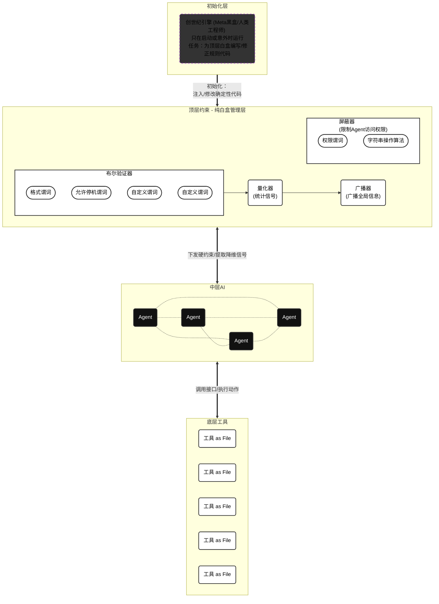

# 反奥利奥架构的AI图灵机 - 顶层的信号控制

本章是前面3章《 ‣ 》、《 ‣ 》、《 ‣ 》的集大成者。读者务必首先复习相关内容。

---

在由无数⚫中层黑盒（Agent个体）组成的复杂生态中，顶层白盒绝不能是一个试图微观操纵（micromanagement）一切的“全知独裁者”。相反，它的职责是冷酷、透明且机械的，其核心任务可以精炼为对系统信息的管理——具体而言，是对信号的量化、广播、与屏蔽。

当 Agent 的代码吞吐量远超人类时，人类工程师的核心价值不再是「写代码」，而是进入“管理层”「设计让 Agent 可靠工作的环境」 。这个环境的质量，决定了整个系统的上限 。因此，顶层白盒必须通过以下三个维度的信号工程，来构建这个环境。

# 信号的量化

在反奥利奥架构中，顶层白盒的首要任务是对中层黑盒的输出进行有损压缩。中层黑盒的每一次推理、每一次试错，其内部状态都是高维且充满噪声的。如果顶层试图去理解这些高维状态，它自身也会不可避免地退化为黑盒。因此，顶层必须通过严密的形式化规则，将复杂的行为结果压缩为确定性的低维标量。这种量化过程拒绝任何主观的估值与解释，只依赖于客观的物理结果或**确定性的逻辑校验**。

## 布尔信号

<aside>
📌

### 什么是“谓词”（Predicate）？

在逻辑学和计算机科学中，谓词本质上就是一个“只做判断题的机器”。你给它一个或多个输入，它经过确定的规则运算后，永远只会输出两个结果之一：真（$1$）或假（$0$）。

$$
f:X \to \{0,1\}
$$

---

比如在“苹果是红色的”这句话里，“是红色的”就是谓词，用来描述主语（苹果）的客观属性。在逻辑的世界里，谓词剥离了所有的文学色彩，变成了极其冷酷的判定规则。

你可以把它想象成工厂流水线上的一个严格质检卡口。如果看到传送带传来的苹果是红色的，它输出 $1$（放行）；如果苹果还未成熟不是红色，它输出 $0$（拦截）。

</aside>

直白地说，布尔信号就是验证有没有通过。

它是非黑即白的 0 或 1，通常用于确立系统的绝对边界条件。在真实世界的工程实践中，我们必须认清一个严酷的事实：自然语言约束（例如在提示词中写上“请遵守架构规范”）是软约束，永远有概率漏网 。因此，顶层白盒不能依赖语言（另一个黑盒）来约束黑盒，必须将其转化为机器可执行的硬约束，例如自定义的 Linter 检查、CI（持续集成）测试或结构化数据校验 。不管黑盒内部的概率分布如何，顶层只看它是否违规——非黑即白的 0 或 1。

<aside>
⚙

**工程现实的妥协：PCP 谓词与“疑罪从无”**

在前文示例中，我们探讨的主要是针对先验知识（如数学计算、人造游戏、代码语法合法性）的完美谓词。但在实际工程中，尤其是在处理复杂的后验问题（例如：UI 布局是否合理、自然语言回复是否礼貌、开放环境中的视觉识别）时，我们通常无法写出一个 100% 完美的谓词函数。

当完美谓词不可得时，顶层白盒的约束机制就必须退化为 **PCP 谓词**。

这种机制在工程实现上遵循一种类似于“疑罪从无”的非对称验证原则：

1. **绝对不误杀（Completeness = 1）**：如果中层黑盒（Agent）给出的候选解确实是正确的，谓词必须总是接受（$1$）。
2. **高概率拦截（Soundness error 极小）**：如果候选解是错误的，谓词不需要做到全知全能地识别出所有错误，但必须以极高的概率拒绝（$0$）它。

在“反奥利奥架构”中，这种退化不仅是可以接受的，更是系统能够处理复杂现实问题的关键。因为中层黑盒本身具有极高的生成吞吐量，会进行高频的试错。只要顶层的 PCP 谓词能保证“正确的绝对能存活，错误的很难连续蒙混过关”，即使偶尔有漏网之鱼，系统在宏观的统计演化上依然会坚定地收敛向最优解。这正是工程学中用概率换取系统可行性的经典智慧。

</aside>

## 统计信号

当候选解通过了布尔信号的底线验证后，顶层白盒需要进一步衡量其相对有效性，这就引入了连续的统计信号，通常分布在 $\left[0,\infty\right)$ 的区间内。统计信号本质上是顶层白盒使用确定性的统计算法，将中层黑盒群体产生的海量、复杂、充满噪声的数据，压缩并统计成简洁的连续标量信号。

顶层白盒此时并不去“审阅”，而是直接运行统计算法。例如：

- 共识提取（求众数/中位数）：当多个 Agent 针对同一问题独立给出不同答案时，顶层白盒通过计算众数或中位数，机械地剥离掉极端的“幻觉”偏差，直接提取出群体的共识。
- 信誉累积（计数器）：统计某个 Agent 提出的方案在后续流程中被其他 Agent 成功调用的总次数。这个数字越大，该 Agent 在系统中的权重信号就越强。
- **效用评分（求期望/方差）**：顶层白盒不需要懂得 AI 是如何写诗或编程的，它只需要在 AI 工作的环境里装满观测工具，然后用严谨的数学公式（求平均、求方差）算出一份“体检报告”。用这份纯客观、不能造假的体检报告，来决定给哪些 AI 升职加薪，把哪些 AI 淘汰出局。

在这个过程中，统计算法本身没有任何“智能”（绝对的白盒），但它极其有效。通过大数定律，微观个体层面的随机幻觉和偶然失误被统计学抵消。无论中层黑盒的推理过程多么不可解释，宏观层面上最终都会涌现出一个稳定、客观、可比较的信号，为系统后续的演化和资源分配提供了极其明确的指引。市场经济中的价格就是最典型的统计信号。顶层机制并不关心某一个具体的个体为何出价，它只客观记录成千上万次交易交汇点所形成的数值。

# 信号的选择性广播

量化后的信号如果仅仅停留在顶层，系统依然是一盘散沙。管理的核心在于引导群体的演化方向，而这依赖于顶层白盒将信号有效地广播给中层个体。然而，在信息论的视角下，无差别的全量广播会导致严重的通信过载。因此，高效的反奥利奥架构必须执行选择性广播。

## 广播典型错误

在庞大的黑盒集群中，无差别的试错成本是极其高昂的。当某一个黑盒触发了底层的布尔硬性约束时，顶层白盒首先会在瞬间向该个体精准注入包含修复指引的错误信息（Error Message），引导其自我纠错。

但这还不够。如果发现多个 Agent 都在同一个地方跌倒（即所谓的“典型错误”），顶层机制会将这类典型错误抽象出来，并通过更新全局的架构文档广播给所有Agent。注意，顶层白盒决不能把这些具体的报错日志群发给所有人——那会造成灾难性的上下文污染。这种将个体失败经验转化为全局规则的“广播”，有效地剪枝了整个群体的搜索空间，避免了大量算力在已经被证明为无效的路径上产生冗余损耗。

## 广播价格信号

价格信号的广播是驱动群体产生正向涌现的引擎。在复杂的任务中，总有一些子目标或特定资源的价值远高于其他部分。顶层白盒通过广播高权重的标价（例如悬赏特定的任务实现、或者对紧缺资源标出高价），来引导黑盒的注意力分布。这种广播不对黑盒指手画脚，不提供解决问题的具体步骤，它仅仅广播信号仅此而已。黑盒个体在接收到这些高价值信号后，会自发地调整其行为的倾向，将更多的生成能力倾注到系统最需要的地方。

<aside>
💭

### 探索（Exploration）与利用（Exploitation）

在广播价格信号的动态过程中，系统必须在探索（Exploration）与利用（Exploitation）之间维持精妙的平衡。如果中层黑盒对最高分信号过度敏感（过度利用），所有中层黑盒都会迅速收敛到同一个局部最优解，导致群体丧失多样性，甚至陷入集体平庸；反之，如果中层黑盒过度不敏感（过度探索），也就相当于压根没有任何信号。

</aside>

# 信号的选择性屏蔽

在复杂网络中，信息的过载往往也同样是灾难的开始。中层黑盒的本质决定了它们不仅会产生奇思妙想，也会产生幻觉。顶层白盒必须像物理上的绝缘层一样，执行冷酷的信号屏蔽，防止局部错误引发系统性的级联雪崩。

### 屏蔽错误

由于黑盒个体在推理时会从当前上下文中进行模式学习（In-Context Learning），它们无法分辨“历史遗留的错误模式”和“精心设计的正确模式” 。一个坏模式一旦污染了上下文，会被后续所有 Agent 当成“正确示例”学习，时间越长，坏模式的出现频率越多，传播速度越快，这正是技术债漂移的根源 。

因此，屏蔽错误不仅意味着在运行时切断个体的错误输出，更意味着必须在宏观架构上建立持续的垃圾回收机制 。顶层白盒需要像清理内存一样，部署后台 “园丁Agent” 定期扫描并屏蔽掉那些偏离黄金原则的陈旧代码与过期文档，确保系统熵值不会随时间失控。

### 封装细节

对于黑盒而言，Context 是零和资源：注入的信息越多，每个 token 的相对注意力权重越低 。如果顶层白盒试图把所有的系统规则写成“一个巨大文档”一次性塞给每一个个体，关键的约束信号就会被彻底淹没在大量规则中，导致黑盒行为发生不可预测的漂移 。

所以，顶层白盒必须执行严格的细节封装与渐进式披露 。它不应该提供一本百科全书，而应该提供“百科全书的目录接口” 。Agent 按需加载特定文档，避免上下文被无关信息污染 。通过屏蔽无关细节，顶层确保了黑盒有限的注意力能够高度聚焦在当前的任务刀刃上。

### 屏蔽相关性

群体智慧的一个基本定理是：只有当个体样本相互独立时，群体的统计信号才具有收敛的数学意义。如果所有的黑盒都在共享完全相同的实时上下文和中间状态，它们的输出将会高度相关，最终导致一万个黑盒的智慧退化为一个黑盒的智慧。因此，顶层白盒必须刻意屏蔽个体之间的横向相关性。通过隔离它们的信息源，顶层强制维持了群体的异质性，从而保证了群体智慧在面对未知问题时的广度，使得同一问题被从不同角度审视 。

### 屏蔽Goodhart问题

管理学与经济学中有一个著名的古德哈特定律（Goodhart's Law）：“当一个度量成为目标时，它就不再是一个好的度量。”由于中层黑盒具备强大的模式匹配和概率优化能力，如果它们能够完全窥探到顶层白盒的打分算法细节，它们必然会放弃解决实际问题，转而生成专门用来骗取高分的讨巧输出。为了彻底屏蔽这个问题，顶层白盒的验证机制必须对黑盒保密。顶层应将具体的度量逻辑写在中层无访问权限的区域，黑盒只能通过不断试错来感受错误信息（Error Message），而无法直接将度量函数本身作为优化的捷径。

---

<aside>
🗣

> When something failed, the fix was almost never 'try harder.' The fix was always: 'what capability is missing, and how do we make it both legible and enforceable for the agent?'
当某个环节失败时，修复方案几乎从来不是“再努力一点”。修复方案永远是：“系统缺失了什么能力，我们如何让这种能力对 Agent 既清晰可见又可被强制执行？”[1]
—— Ryan Lopopolo, OpenAI 技术成员
> 
</aside>

在这套基于信号的管理体系下，人类工程师的角色发生了根本性的转变。我们不再要求黑盒个体在自然语言的软约束下奇迹般地不犯错，因为要求一个概率生成模型“更加努力”本身就是一个伪命题。

正如 OpenAI 工程报告[1]最终得出的深刻结论："Building software still demands discipline, but the discipline shows up more in the scaffolding rather than the code." 软件工程的本质没有改变，但纪律性更多地体现在脚手架（scaffolding）上，而不是代码本身 。真正的管理者，应当将自身对架构的品味与直觉，显式编码为机器可执行的工具、抽象和反馈循环 。通过极其克制但绝对确定的信号量化、广播与屏蔽，我们在秩序与混乱的交界处建立起强大的顶层白盒，让群体智慧得以在其中生生不息。

# Reference

[1]“Harness engineering: leveraging Codex in an agent-first world | OpenAI.” Accessed: Mar. 06, 2026. [Online]. Available: [https://openai.com/index/harness-engineering/](https://openai.com/index/harness-engineering/)