# 群体智慧的架构：⚪⚫⚪反奥利奥理论

<aside>
🗣

> Smart people can never work together, […] my job is making sure they work together.
聪明人无法共事；我的工作就是让他们共事。
—— 马云
> 
</aside>

前章探讨了《 ‣ 》，那么群体智慧又是什么样的？本章作为“哲篇”的最后一章，将带领读者用最宏观的视角来探讨这一问题前置知识

为了理解这一点，我们需要引入一套观察框架：**白盒与黑盒**。

<aside>
📌

- **⚪ 白盒（White Box）**：
    - 代表**确定性**。
    - 它是可解释、透明、可理解、可稳定预测的系统。
    - *譬如：牛顿定律、计算机代码、数学公式、法律条文。*
- **⚫ 黑盒（Black Box）**：
    - 代表**可能性**。
    - 它是不可解释、不透明、难以理解、难以预测的系统。
    - *譬如：人类的直觉、艺术灵感、生物神经网络、大模型的“幻觉”与涌现。*
</aside>

<aside>
💡

## **审美直觉 vs 数学推理**

### **问题1（⚫黑盒）**

下面两张脸，谁在真心地笑？

source：AIGC

大多数人可以瞬间给出答案，但很难完整解释为什么。

### **问题2（⚪白盒）**

计算：

$$
37 \times 24 = ?
$$

读者可以列出分配律步骤：

$$
37 \times (20+4)=740+148=888
$$

</aside>

在传统的工程学思维中，我们要消除黑盒，追求全白盒世界。但在**智慧哲学**中，我们必须承认：**没有黑盒，就没有创造力；没有白盒，就没有稳定性。**

真正的高级智慧系统，永远是两者的动态组合：

- **黑盒 → 主动调用 → 白盒工具**
- **黑盒 ← 被动约束 ← 白盒约束**

因为智慧本质上是**在秩序与混乱的交界处起舞**。

# 智慧体的二层“反蜜獾”架构：工具作为通用和专用的桥梁

| 智慧体 | 黑盒 | 通用 | 低效 |
| --- | --- | --- | --- |
| 工具 | 白盒 | 专用 | 高效 |
| 允许智慧体发明、使用工具 | 黑盒 | 通用 | 高效 |

在计算机科学和生物演化中，一直存在一个“通用性-效率”陷阱：一个系统越是通用，它在处理特定任务时就越低效；反之，一个系统越是专业（专用），它就越难以适应多变的情况。这背后与NFL定理有着微妙的关系。

人类和未来的通用人工智能（AGI）之所以能跨越这个陷阱，核心秘密不在于把“黑盒”练得无所不能，而在于构建了一个**二层架构**。

## 1. 通用性的代价：低效的黑盒

单纯的**中层黑盒**（如人类大脑或大模型底层）是高度通用的。它能写诗、能编程、能思考宇宙。但这种通用性是以**高能耗**和**低精确度**为代价的。

- **人类大脑**：我们可以口算三位数乘法，但速度极慢且极易出错。因为大脑的神经网络本质上是处理概率和模糊关系的黑盒，并不擅长高强度的逻辑串行计算。
- **大模型（LLM）**：它可以回答几乎任何问题，但在面对复杂的数学运算（如 $12345 \times 67890$）时，它往往会产生幻觉。

## 2. 工具的诞生

从原始人捡起一根木棍的那一刻开始，人类就开启了工具文明。工具（Tool） 的出现，是智慧体的一次“功能外包”。

每一个成熟的工具，本质上都是一段被固化的白盒逻辑。无论是石斧、杠杆，还是计算器、搜索引擎、Python解释器，它们都有共同的特点：

- **功能专用**：计算器只负责算数，它不会写诗。
- **绝对确定**：只要输入相同，输出永远一致。
- **极致高效**：在它擅长的领域，效率高出通用智慧体数个数量级。

## 3. 协同：通过“调用”实现的效率飞跃

当我们允许**黑盒智慧体**去发明并使用**白盒工具**时，奇迹发生了：**智慧体维持了它的“通用性”，而任务执行获得了“高效性”。**

这种二层架构改变了智慧的运作范式：

- **⚫黑盒**：它理解目标，识别当前遇到了什么问题，并决定何时调用哪个工具。
- **⚪白盒**：专用工具。

<aside>
💭

智慧的本质进化，不是让黑盒变得更会算数，而是让黑盒变得更会使用计算器。

</aside>

这种“调用”逻辑，让智慧体从一个闭合的单体，变成了一个可扩展的系统。当我们说一个人“聪明”时，往往指的不仅是他的脑细胞活跃，更是指他能够熟练地调动社会积累的各种白盒工具（理论、软件、器械）来解决问题。

然而，这种“二层架构”只是微观个体的智慧逻辑。当我们把视角放大到群体智慧时，这种结构会进一步演化为更宏大的“三层反奥利奥架构”。

<aside>
💭

尤其是在“先验知识”占主导地位的领域，⚪白盒的优势是几乎压倒性的程度。

在这种情境下，如果仍然让⚫黑盒单独处理问题，往往是在用概率近似去逼近一个本已完全已知确定的规则。黑盒可以通过大量样本学习出“近似解”，但它永远在逼近；白盒则直接高效给出精确解。两者在效率与误差结构上的差异，是压倒性的。

当黑盒被接入白盒工具后，系统性能的提升不是线性的，而是结构性的：

第一，计算效率提升。黑盒无需再通过多步概率推断去“猜”一个确定答案，而是通过一次接口调用直接获得结果。复杂度从“推理深度”下降为“快速调用一次白盒工具”。

第二，准确性提升。白盒在定义域内不存在“幻觉”，只存在“未定义”或“非法输入”。这使错误模式从“概率漂移”转化为“边界问题”，错误空间被极大压缩。

第三，鲁棒性提升。黑盒在分布外输入时往往失真，而白盒只要规则未变，行为就不会随环境波动而退化。稳定性来自规则，而不是来自经验。

更极端的情况是：在许多纯先验结构主导的任务中，⚪白盒本身已经足够完成全部工作，⚫黑盒甚至是多余的。例如确定性算法求解一个已知问题、验证一个形式化证明、执行标准协议传输、模拟一个规则封闭的系统。在这些场景里，黑盒的引入反而会增加不确定性与误差传播路径。系统的最优解是“纯白盒执行”。

这也揭示了一个关键分界：黑盒的价值在于处理“未知”、“未形式化”的部分；而先验知识一开始就是“知道完整的Ground Truth”、“完全形式化”的，**任何纯⚫黑盒的解都会惨痛地输给⚫黑盒套⚪白盒的二层架构。**

</aside>

---

# 群体智慧的三层“反奥利奥架构”

如果我们透视任何一个高效的智慧群体，无论是蚁群、人类社会还是未来的AI集群，都能发现这种三层嵌套的关系：

如果我们透视任何一个高效的智慧群体——无论是千万年的蚁群、现代人类文明，还是未来即将爆发的AI集群——我们都能发现一种惊人一致的拓扑结构。

## 1. ⚪顶层白盒：生态的约束、管理机制

<aside>
🗣

> 如果你不能度量它，你就无法管理它。(If you can’t measure it, you can’t manage it.)
—— 管理学大师彼得·德鲁克（Peter Drucker）
> 
</aside>

<aside>
🗣

> 组织的功能就是要让平凡的人在一起做出不平凡的事情来。所以，管理不是＂管理人＂，而是＂领导人＂。
—— 管理学大师彼得·德鲁克（Peter Drucker）
> 
</aside>

顶层必须是白盒的。
它并不规定每个个体具体做什么，而是规定了“哪种行为会被奖励、惩罚、允许、禁止”，同时也负责广播或屏蔽特定信息。它并不规定每个个体具体做什么，而是规定了具体*不能*做什么。在《 ‣ 》的《 ‣ 》章中，我们介绍了很多验证的技巧。解决问题是黑盒更擅长的，但是如果充分利用验证候选解（candidate solution）的计算技巧，就可以大大降低白盒的计算量，以至于看似更弱的白盒可以管理更多更强的黑盒。

- **作用**：确保群体在动态博弈中不会崩溃（熵增），并引导群体向着某个总体目标演化（负熵）。
- **特性**：冷酷、透明、无情。

<aside>
🗣

> 天地不仁以万物为刍狗。
—— 老子《道德经》
> 
</aside>

<aside>
🗣

> 普通智力的人不能被要求去猜测[一项法规]的含义。
—— 美国最高法院 Winters v. New York, 333 U.S. 507 (1948) –
> 
</aside>

<aside>
🗣

> 物理律是真正的法律，其他法律都只是建议。（Physics is the law, everything else is a recommendation. ）
—— 诶隆·马斯克 （世界首富）
> 
</aside>

## 2. ⚫中层黑盒：智慧的执行个体

中层必须是黑盒的。
这是智慧涌现的**发动机**。每一个个体（生物、人、或AI Agent）都是一个独立的处理单元。

- **作用**：处理复杂性、产生随机变异、提供创造力。我们无法完全预测一个人的下一个念头，也无法准确预知大模型输出的每一个Token。
- **特性**：这种“不可预测性”不是Bug，而是Feature。正是因为个体是黑盒，群体才能在面对未知的环境挑战时，涌现出意想不到的解决方案。这种“黑盒式”的灵活性正是应对复杂环境的关键。

<aside>
💭

这背后是一个简单暴力的数学概率问题：

假设⚫通过⚪验证的概率是$p$，无论这个概率多么小，那么⚫只需要平均试错$\frac{1}{p}$次就能成功一次—— 一次就够了。

所有对⚫的优化都是在优化这个$p$，而这对整个反奥利奥架构不造成颠覆。

</aside>

## 3. ⚪底层白盒：工具的底层逻辑

底层又是白盒的。这是个体使用的“工具”。当智慧个体决定执行某个动作时，它所依赖的工具、器官必须是极其稳定、确定且可理解、可预测的。底层白盒不仅是工具，还是“事实的锚点”。没有底层的确定性，中层的创造力就会变成“幻觉”。

- **作用**：赋能中层的智慧体。
- **特性**：设想如果一把锤子（工具）有时是硬的有时是软的（黑盒化），工匠（中层）就无法工作。基础科学、逻辑学、API接口，必须维持白盒的绝对稳定性。

这种白-黑-白结构构成了我们本章讨论的反奥利奥理论。

<aside>
ℹ️

真正的奥利奥饼干是“黑-白-黑”（两块黑色饼干夹着白色奶油）。

</aside>

# 从生物到AI的案例

为了更清晰地理解这一模型，我们可以对比几种典型的群体智慧形态：

|  | 象棋智慧 | 生物群体智慧 | 人类群体智慧 | AI群体智慧 |
| --- | --- | --- | --- | --- |
| **顶层白盒** (约束) | 象棋规则 | **达尔文机制**：规则极其透明且残酷：适者生存，不适者死亡。它不关心个体的痛苦，只关心种群的延续。 | **法律与经济机制**：法律划定底线（什么不能做），市场价格信号引导奖励（做什么有钱赚）。 | 自定义生态约束机制 |
| **中层黑盒** (个体) | 棋手：一场精彩的象棋比赛，2个棋手缺一不可。 | **个体生物**：蜜蜂、蚂蚁。虽然单体神经简单，但其决策逻辑对外部观察者仍是黑盒。 | **个体人类**：拥有自由意志、情感和复杂经验的生命体。 | 个体AI：它负责推理、规划、想象。它是概率性的，因此也是不可完全预测的。 |
| **底层白盒** (工具) | 棋子（不会在棋盘上随机滚动）、计时器（读数精确）、草稿纸…… | 生物器官基于物理定律
• 眼遵循光学
• 翅膀遵循空气动力学
• 触角遵循化学 | 人类发明的工具（实体工具和知识理论）都基于已知科学原理。人类用黑盒大脑指挥白盒工具。 | AI使用传统白盒算法打造的工具
• 计算器
• Python解释器
• 数据库查询
• 搜索引擎 |

## 案例: 自然界的案例：蚁群

在蚁群中，没有一只“蚁王”在发号施令（蚁后只是生殖机器，不是CEO）。

- **⚪顶层**：进化压力（达尔文机制）。找不到食物的群落灭亡。
- **⚫中层**：每一只蚂蚁独立行动（布朗运动），这是一个充满噪音的黑盒过程。
- **⚪底层**：信息素（Pheromone）。这是一种化学物质，它的挥发速度遵循物理定律（白盒）。
- **涌现**：乱跑的蚂蚁（⚫）留下了信息素（⚪）于其他蚂蚁沟通。最终，一条最短、最高效的觅食路线在没有指挥的情况下诞生了。

## **案例: 从原子到宇宙：物理学**

为什么我们的宇宙能够孕育生命？这一问题在表面上看似终极而神秘，但若从“反奥利奥”结构审视，物理学本身已经给出了一个高度一致、却并不直观的答案。

- **⚪**在最底层，原子尺度的物理学是高度白盒化的。
    - 量子力学以近乎残酷的精确性描述了电子轨道、能级跃迁、化学键形成与破裂的统计规律。虽然量子测量具有概率性，但其概率结构本身是严格、稳定、可形式化的。正是这种白盒性质，使得分子能够稳定存在，化学反应具有可重复性，碳基结构得以长期维持。如果底层量子规律是“随意的”或不可复现的，复杂化学乃至生命本身将无从谈起。物理学家可以轻易理解这一层白盒，甚至无需借助计算机。
- **⚪**在最顶层，宇宙尺度的物理学同样呈现出高度白盒化的特征。
    - 广义相对论以确定性的几何结构描述时空、引力与能量分布的关系。宇宙的膨胀、恒星的演化、行星轨道的长期稳定性，都可以在这一框架下被精确预测。相对论并不关心生命是否存在，但它为“稳定背景”的存在提供了冷酷而可靠的约束：恒星不会随意熄灭，行星不会随机脱轨，宇宙不会在短时间尺度内自发坍缩。这种顶层白盒，为生命的长期演化提供了时间窗口。物理学家可以轻易理解这一层白盒，甚至无需借助计算机。
- **⚫**然而，真正有趣的是中间层的物理学。
    - 介于量子尺度与宇宙尺度之间的世界——流体、气候、大气、海洋、恒星内部对流、行星气象——在理论上依然遵循确定性的微分方程，例如 Navier–Stokes 方程。但在实践中，这一层几乎是彻底的黑盒。湍流问题至今没有通解，长期气象预测存在不可消除的误差，混沌系统对初始条件的指数级敏感，使得“原则上可解”在工程与认知层面退化为“事实上不可预测”。

关键在于：这种黑盒性并非物理学的失败，而是复杂性本身的必然结果。中层物理系统中，微小扰动被迅速放大，信息在尺度之间不断混合与耗散，任何有限精度的测量都会在时间推进中失效。换言之，中层并不是“规则不清晰”，而是“规则过于丰富”，以至于无法被压缩为稳定的白盒形式。

从反奥利奥的角度看，生命并不是诞生于一个“全白盒宇宙”，而是恰恰诞生于一个白盒夹着黑盒的世界：底层物理规律稳定可靠，顶层宇宙结构冷酷约束，而中间层充满不可预测的波动、噪声与非线性。正是这种中层黑盒，为生命提供了必要的“孕育空间”。如果气候完全可预测，生态系统将趋于静态；如果流体完全线性，能量与物质的自组织将难以发生。生命需要的不仅是稳定性，还需要一定程度的混乱。

因此，“宇宙为何适合生命”并不意味着宇宙在中层层面被精心调谐为可理解的机器。相反，它意味着宇宙在关键位置上拒绝被完全理解。底层白盒保证物质存在，顶层白盒保证结构长期稳定，而中层黑盒则不断制造差异、扰动与偶然性。生命，正是这一反奥利奥结构中的涌现产物。

物理学在这里并未承诺全知，而是无意中展示了一种更深刻的智慧架构：并非每一层都需要被掌控，真正重要的是，白盒与黑盒是否站在了正确的位置上。

## 案例: 人类文明的案例：市场经济

现代社会之所以比封建社会更具“群体智慧”，是因为我们将架构从“全黑盒”（人治）转向了“反奥利奥”。

- **⚪顶层**：“看不见的手”和“看得见的法”。如果不允许杀人越货（法律白盒），大家就只能通过改进产品来赚钱（市场白盒约束）。
- **⚫中层**：乔布斯、马斯克，……和每一个人。他们的欲望、灵感和决策是深不可测的黑盒。
- **⚪底层**：互联网协议（TCP/IP）、集装箱标准、货币结算系统、螺丝刀、剪刀、……。这些必须是标准化的白盒。
- **涌现**：我们不需要一个“总调度师”来决定今天生产多少部iPhone，市场机制（⚪）会自动引导企业家（⚫）利用全球供应链（⚪）完成这一奇迹。

## 案例: 百万步的零误差奇迹 (MAKER 架构)

<aside>
ℹ️

汉诺塔（Tower of Hanoi）是一个经典的递归问题，常被用来展示**规则约束下的复杂性如何指数级增长**，因此在本文中并非偶然出现。

汉诺塔由三根柱子和若干大小不同的圆盘组成，初始时所有圆盘按从大到小的顺序叠放在第一根柱子上。目标是在遵守固定规则的前提下，将所有圆盘完整地移动到第三根柱子上。规则只有两条：第一，每次只能移动一个圆盘；第二，任何时刻都不允许把较大的圆盘放在较小的圆盘之上。这两条规则本身是极其“白盒”的：完全确定、无歧义、不可通融。

</aside>

汉诺塔（Tower of Hanoi）

最新的 AI 研究《Solving a Million-Step LLM Task with Zero Errors》[1]提供了一个极端且完美的“反奥利奥架构”样本。研究人员挑战了一个看似不可能的任务：让 AI 解决 **20 层汉诺塔**。这需要连续执行 **1,048,575 步** 操作，且中间不能有任何一次失误。

- **难点**：传统的单个大模型（单个大⚫）根本做不到。即使每步准确率高达99.9%，在100万步的累积下，成功率也会归零 。

为了实现“零错误”，研究人员设计了名为 **MAKER** 的架构，这正是标准的⚪⚫⚪结构：

| ⚪⚫⚪ 层级 | MAKER 系统实现方式 | 哲学解读 |
| --- | --- | --- |
| **⚪ 顶层白盒** | **递归拆解与“首领先K票”投票制 (Voting)**
1. **极端拆解**：⚪系统强制将任务拆解为原子步，⚫Agent 只许处理当前微小步骤，严禁思考长程全局。
2. **共识过滤**：每一步由多个 Agent 并行生成，只有当某一动作的票数领先其他选项达到 K 票时才通过。

**红旗法则 (Red-Flagging) 与格式硬约束**
底层通过确定性的代码逻辑监控 Agent 输出。如果 Agent 开始产生废话（Token 过长）或格式错误，会被立即熔断并重试。 | **不信天才，只信机制**。顶层不参与思考，只“无情地”通过规则（白盒）来对冲掉个体黑盒的偶然性错误。 |
| **⚫ 中层黑盒** | **微型执行体 (Micro-Agents)**架构中使用的并非巨型模型，而是廉价、快速的轻量级 LLM。这些 Agent 负责将当前的盘面状态转化为逻辑步骤。 | **承认个体的局限**。中层黑盒不需要具备“百万步”的远见，只需要在被限制的极小空间内发挥其概率推理能力。**黑盒负责产生变异，白盒负责约束变异。** |
| **⚪ 底层白盒** | **汉诺塔模拟器**
1. 固定提示模板ϕ：使用预定义的模板将当前汉诺塔状态映射为提示，确保输入标准化。
2. 提取函数ψa与ψx：从LLM输出中确定性地解析动作（action）和下一状态（next state），如通过字符串匹配或JSON解析。
3. 汉诺塔规则模拟：底层代码严格根据游戏规则验证和更新状态，确保每步移动的合法性（如大盘不能压小盘）。 | 中层微型执行体⚫通过汉诺塔模拟器的接口⚪ 输入与输出最新信息。黑盒不是在操作一个“想象中的”汉诺塔，而是在操作那个由汉诺塔模拟器所模拟的汉诺塔。 |

### **涌现的结果**：

通过这种架构，一群“智商平平”且有出错概率的黑盒模型（⚫），被夹心在严格的投票规则（⚪顶层）和接口工具（⚪底层）之间，最终以 **0 错误** 串联起了超过 100 万个逻辑环节。

<aside>
❓

![Plot[{1 - Exp[-x], 1 - Exp[-x^2]}, {x, 0, 2}, PlotRange -> {0, 1}, AxesLabel -> {"x", "f(x)"}, Ticks -> None]](%E7%BE%A4%E4%BD%93%E6%99%BA%E6%85%A7%E7%9A%84%E6%9E%B6%E6%9E%84%EF%BC%9A%E2%9A%AA%E2%9A%AB%E2%9A%AA%E5%8F%8D%E5%A5%A5%E5%88%A9%E5%A5%A5%E7%90%86%E8%AE%BA/image%202.png)

x轴：中层黑盒的数量
y轴：整体成功的概率

当中层没有任何黑盒，显然整体成功的概率是0；当黑盒数量充分多（$\to \infty$），成功概率也该$\to 1$。这两点应该是毋庸置疑的。但是中间的过渡阶段呢？随着中层黑盒的数量增多，你觉得反奥利奥架构成功的概率应该如何上升，更像哪条曲线？

- 蓝色曲线：无相变，智慧逐渐产生
- 黄色曲线：有相变，智慧在某个关键值上突然涌现出来
</aside>

# 从石器文明到AI文明，⚫⚪谁在进化？

如果我们严格站在生物学意义上审视人类自身，那么一个令人不安却又无法回避的事实是：作为文明中间那一层的⚫黑盒个体，人类在过去数万年里几乎没有发生任何生物性的进化。石器时代的智人的大脑体量、神经结构、感知能力、情绪机制，与今天坐在服务器机房里设计大模型的人类，在硬件层面并无决定性差异。一个石器时代的婴儿，只要被完整地置入现代社会的教育与制度环境中，原则上可以成长为优秀的工程师、科学家或企业家。这意味着，文明尺度上的巨变，几乎不可能归因于“⚫人本身变聪明了”。然而，文明确实发生了翻天覆地的变化。从打制石斧到蒸汽机，从算盘到晶体管，从口耳相传的部落记忆到全球同步的互联网与AI系统。

这个反差如何解释？

若中层⚫黑盒并未进化，那么变化必然发生在⚪白盒层面（⚪顶层和⚪底层）。

首先进化的是⚪底层白盒。石器时代的底层工具，锚定在最粗糙、最局部的物理规律之上：杠杆、敲击、摩擦。每一次行动的有效性，都必须由个体亲身试错来验证，知识高度依赖身体经验，几乎无法跨代、跨群体稳定复制。随着数学、几何、力学、电磁学、信息论等白盒知识逐步被形式化，人类开始构建出一种前所未有的“确定性工具层”。蒸汽机不会因工匠心情而改变热效率，晶体管不会因工程师直觉而随意翻转，编译器不会“灵感迸发”。底层白盒越稳定，中层黑盒的试错成本就越低，创造力被释放得越彻底。文明的复杂度，正是沿着白盒工具的阶梯，被一点点抬升上去的。

与之并行进化的，是⚪顶层白盒。原始部落依赖血缘、威望与神话来维持秩序，这些规则相较黑盒化、人格化，无法精确复制，也难以扩展。随着成文法、契约制度、产权界定、货币体系、市场机制的出现，社会首次拥有了不依赖个体德性与智慧的冷酷约束结构。法律不关心人情，只判断行为；价格不解释原因，只反馈结果。正是这种去人格化、去理解化的顶层白盒，使得亿万互不相识的黑盒个体能够在不共享信仰、不互相理解的前提下协同运作。文明规模的跃迁，本质上是规则可扩展性的跃迁，而非智慧密度的跃迁。

在这一视角下，人类文明史呈现出一种反直觉却高度一致的模式：中层⚫黑盒几乎保持不变，而上下两层⚪白盒不断被打磨、外包、自动化。我们并不是“变得更聪明”，而是越来越少地要求个体去承担确定性与全局性的负担。算术被交给计算器，记忆被交给数据库，路径规划被交给导航系统，事实检索被交给搜索引擎。人类黑盒反而因此变得更“纯粹”——更偏向于提出问题、生成假设、做出价值取舍，而非执行白盒性质的工作（例如精确而重复的计算）。

诚然，“⚫个体”非常重要；甚至少数如爱因斯坦这样的个体可以一己之力推动文明。但，从石器文明到AI文明，进化的主角从来不是“⚫个体”，而是文明的⚪白盒架构。文明并非靠⚫天才推动，而是靠⚪规则、工具、与接口的持续外包与标准化前进。

AI文明只是这一长期趋势的继续。真正决定文明是否跨入新阶段的，依然不是⚫模型“有多聪明”，而是我们是否同步进化了它的⚪顶层约束与⚪底层工具、接口。如果底层工具不稳定，AI 的创造力就会退化为幻觉；如果顶层规则不清晰，群体智能就会坍缩为噪声放大器。

理解这一点，才能避免把未来寄托在某个“⚫更聪明的存在”身上，而转向真正困难、也真正有效的方向：同步进化能够长期承载黑盒“夹心”的白盒“饼干”。

# AI Agent集群的顶层管理机制：**价格作为信号（price as signal）**

目前最大的误区是试图把AI模型本身变成白盒（让它不犯错、完全逻辑化），或者试图用AI去替代所有白盒（例如让大模型直接做数学题而不使用计算器）。

**正确的AI进化路径应当遵循“反奥利奥”架构：**

1. **承认中层是黑盒**：接受大模型（LLM）会有幻觉，会有创造性的错误。这是它“智能”的来源。
2. **加固底层白盒**：给AI配备**工具（Tool Use）**。当AI需要计算10位数乘法时，它应该调用Python或其他计算语言（⚪），而不是自己硬猜（⚫）。当AI需要事实时，它应该调用搜索（⚪）。
3. **设计顶层白盒**：一套信号传播机制，让正确的信号脱颖而出。

<aside>
💭

人类群体智慧有“生存本能”作为终极目标，AI 集群的“顶层白盒”终极目标是什么？

</aside>

在市场体系中，没有任何一个中央智能体真正“知道”社会应该生产多少钢铁、芯片或面包。每一个消费者、企业家、工程师和投资者，都是一个局部视角严重受限的黑盒个体。他们只对自己所处的位置、成本结构、偏好和预期负责。然而，当这些黑盒个体被置于统一的白盒规则约束之下——清晰的产权、契约执行、禁止暴力与欺诈、稳定的货币结算体系——价格就开始发挥其核心作用：它将不可言说、不可集中、不可解释的分散信息，压缩为一个单一的、可传播的标量信号。

这一点与本文所讨论的⚪⚫⚪结构高度一致。价格并不试图解释“为什么”某种商品应该涨价或降价，它只是在白盒制度的约束下，对黑盒行为的结果进行被动记录。价格本身不思考、不判断、不富有智慧，但它作为顶层约束的一部分，持续地惩罚低效行为、奖励高效行为，从而在长期尺度上引导整个系统向更高的协调状态演化。正如规则并不关心个体的动机，价格也不关心个体的理由，它们只关心结果。

更重要的是，价格之所以能成为可靠信号，恰恰是因为它拒绝承担中层黑盒的职责。任何试图“理解价格背后的真实意图”“修正价格以体现道德或理性”的做法，都会不自觉地把价格从白盒信号拉向黑盒判断，从而破坏其作为群体协调机制的功能。历史上一切以“更聪明的判断”替代价格信号的尝试，最终都不可避免地走向信息失真与系统性失灵，并非因为决策者不够聪明，而是因为他们试图用有限黑盒去替代一个原本依赖群体涌现的白盒信号系统。当“价格作为信号”被放置在“未来的 AI Agent 集群”这一语境下时，它不再仅仅是一个经济学隐喻，而是直接指向一种**可工程化的群体协调机制**。

## **“标价”，而非“估值”**

在这一节里，需要**非常明确地区分两种完全不同的行为**：

- **标价（pricing）**
    
    在一套**公开、固定、可验证的规则**下，对行为结果给出一个**外显、可比较、可传导的数值信号**。
    
    标价不关心动机、不解释原因，只对**结果负责**。
    
- **估值（valuation）**
    
    由某个主体基于**隐含判断、经验、偏好或模型内部状态**，对行为或方案“好不好”“值不值”作出的**主观评判**。
    
    估值本质上是黑盒判断，即便输出一个数字，规则本身仍不可审计。
    

在反奥利奥架构中，**顶层必须做的是 pricing，而不是 valuation**。前者是白盒信号，后者是黑盒意见。

<aside>
⚠️

一个常见的误解是：顶层需要更聪明，才能判断哪个 Agent 的方案更好。事实上，恰恰相反。**顶层越试图理解方案本身，越容易退化为黑盒估值系统**，从而破坏整个群体结构的可扩展性。

</aside>

## **白盒标价的例子（正确示范）**

**例子一：**Agent 输出被复用次数作为价格信号

在一个多 Agent 协作系统中，不同 Agent 会给出不同的子方案。顶层不评判方案“是否优雅”，而只记录一个事实：

某个方案在后续任务中被其他 Agent 调用了多少次。

- 规则：每一次被成功复用，计该Agent的price +1 分。
- 后果：price高的 Agent 获得更高权重。

这里不存在“这个方案为什么好”的解释过程，只有**行为结果的可观察性**。这是纯白盒标价。

**例子二：错误率驱动的惩罚定价**

在一个需要严格正确性的系统中（例如代码生成、规划执行），顶层可以设定：

- 每一次违反约束，扣除 1 点 price。
- 后果：price低的 Agent 获得更低权重。

规则简单、残酷、可审计，这正是顶层白盒应有的样子。

**例子三：真理掌握在多数人手中**

在一个中层黑盒已经可以大概率独立解决问题的系统中，顶层可以这么设定：

- 对所有中层黑盒的结果做统计，求平均数、或众数、中位数等
- 给更近统计结果的Agent赋予更高的price
- 后果：price高的 Agent 在后续统计中获得更高权重。

规则简单、残酷、可审计，这正是顶层白盒应有的样子。

---

## **黑盒估值的反例（应当避免）**

**反例一：由一个“裁判模型”给方案打分**

常见但危险的做法是：

用另一个大模型来“阅读”“理解”各个 Agent 的输出，然后给出一个 0–10 的评分。

问题在于：

这个评分本身来自一个不可解释的内部状态，既无法验证，也无法复现。它不是 price，而是 opinion。

一旦顶层信号变成 opinion，整个系统就退化为**黑盒套黑盒**。

**反例二：人工规则中夹杂隐性判断**

例如：

“如果方案看起来比较合理，可以适当加分。”

“如果逻辑链条比较清晰，可以放宽错误惩罚。”

这些看似“更聪明”的补丁，实际上是在把顶层白盒污染为中层判断，最终导致信号失真和系统不稳定。

---

# **顶层白盒真正要做的事**

## 确立系统的Ground Truth

<aside>
🔗

参考《 ‣ 》

</aside>

顶层白盒只做三件事，而且每一件都必须是确定性的：

第一，**定义可观测的结果指标**。

例如：任务是否完成、是否超时、是否违反约束、是否被下游系统采纳、是否产生错误或异常。这些指标必须来自系统行为本身的明确反馈，而不是来自“感觉”“理解”或“解释”。

<aside>
💭

在AlphaGoZero的训练中，一局棋下完后，谁赢了？就是系统行为本身的明确反馈——无歧义、无争议。

</aside>

第二，**将结果压缩为统一标量信号**。

无论中层 Agent 使用了多复杂的推理路径、多精妙的提示工程，顶层最终只负责给每个Agent标一个价格。

- 价格可以简单到只有$\left\{0,1\right\}$两个字，代表每个Agent可信、或不可信
- 再复杂一点的价格也可以是$\left[0,\infty\right)$的任何数，代表每个Agent都有一个连续的权重值

第三，**让信号反向作用于资源分配**。

算力额度、调用频率、执行优先级、做统计时的权重，都必须与标价结果直接挂钩。

这三步合在一起，构成了一个完整的 **white-box pricing loop**。

---

## **给设计者的可操作性原则**

对于希望构建 AI Agent 集群的读者，可以遵循以下三条硬原则：

第一，**顶层规则必须能被写成代码，而不是写成prompt（提示词）**。

一条无法形式化成代码的规则，本质上就是黑盒。

第二，**标价永远针对结果，不针对过程**。

过程属于中层黑盒的自由空间，顶层不应介入。

第三，**宁可信号少，也不要信号“自作聪明”**。

一个稀疏但公正的*标价*信号，长期效果一定优于一个“看起来更懂内容”的*估值*系统。

<aside>
💭

在AlphaGoZero的训练中，每局只有1比特信号：输、赢。

</aside>

---

## **价格不是智慧，但它筛选智慧**

在未来的 AI Agent 集群中，价格不是为了告诉系统“什么是对的”，而是为了让**有效的行为自然存活下来**。它不理解、不解释、不共情，只负责冷静地记录结果，并把结果转化为资源流向。

这正是价格作为信号的力量所在：**它让顶层保持白盒，让中层保持黑盒，让群体智慧得以扩展，而不需要一个全知的裁判。**这一点一旦被搞错，AI 集群就不再是反奥利奥结构，而只是黑盒互相评价黑盒的幻觉放大器。

# 总结

```mermaid
flowchart TD
    
    classDef white fill:#fff
    classDef black fill:#000
    
    subgraph high[顶层约束]
    h1(总管):::white
    end
    
    subgraph middle[中层AI]
    m1(Agent):::black
    m2(Agent):::black
    m3(Agent):::black
    m4(Agent):::black

    end

    subgraph low[底层工具]
    l1(工具):::white
    l2(工具):::white
    l3(工具):::white
    l4(工具):::white
    l5(工具):::white

		end
    
    high<==>middle<==>low
    
    

    

    m1-.-m2
    m1-.-m3
    m1-.-m4

    

    m2-.-m3
    m2-.-m4

    
    m3-.-m4

    

    
    
    

	
```

群体智慧不是个体智慧的简单堆积，而是通过“反奥利奥”架构（⚪顶层约束-⚫中层个体-⚪底层工具）实现的高阶涌现。孤立的个体智慧有限，而群体通过黑白盒的动态平衡，能处理远超单体的复杂性。这为未来AI集群指明方向：不要追求完美个体，而是构建可靠生态。最终，智慧源于秩序与混乱的交界。

本章作为“哲篇”的终章回应了前文《 ‣ 》的标题，孤立的反义词，群体，只是智慧的必要条件，一个好的反奥利奥架构才是充分条件。

<aside>
💭

在“顶层白盒”的设计中，谁拥有编写规则的权力？如果规则本身带有偏见，群体智慧是否会演变成“群体平庸”甚至“群体暴政”？

</aside>

<aside>
ℹ️

**“再加一层”：构思反奥利奥架构背后的轶事：**

---

实数$\mathbb{R}$（Real Number）是1维的。数学家将2个实数“拼”在一起于是就形成了复数$\mathbb{C}$（Complex Number），是2维的，而且数学家门发现2维的复数完美适用于表示2维空间的旋转。

套体系如此优雅，以至于数学家们自然而然地想要更进一步——用同样的思路构造一个3维的数体系，来优雅地表示3维空间的旋转。数学家们在这个问题上卡了很久，直到威廉·罗文·汉密尔顿（William Rowan Hamilton）在1843年的一个散步途中突然灵光一现：“再加一层。”

最终数学家们看了他的研究成果才恍然大悟，3维的旋转居然要用4维数来表示。这就是著名的四元数（Quaternion）。

---

作者我在思考反奥利奥架构的时候也陷入了类似的困境。起初我一直在纠结应该是白盒套黑盒（⚪⚫）还是黑盒套白盒（⚫⚪）。两种情况都各有各的道理。因此久久拿不定主意。直到有一天我也突然灵光一现：“再加一层”……以上两种情况的黑是同一个黑而白却不是同一个白，因此反奥利奥架构（⚪⚫⚪）应运而生。

---

这个轶事提醒我们：真正的颠覆性洞见，往往“伟大不能被计划”，而是在黑盒灵感与白盒验证的交界处，突然涌现的“再加一层”。

</aside>

# Reference

[1]E. Meyerson *et al.*, “Solving a Million-Step LLM Task with Zero Errors,” Nov. 12, 2025, *arXiv*: arXiv:2511.09030. doi: [10.48550/arXiv.2511.09030](https://doi.org/10.48550/arXiv.2511.09030).