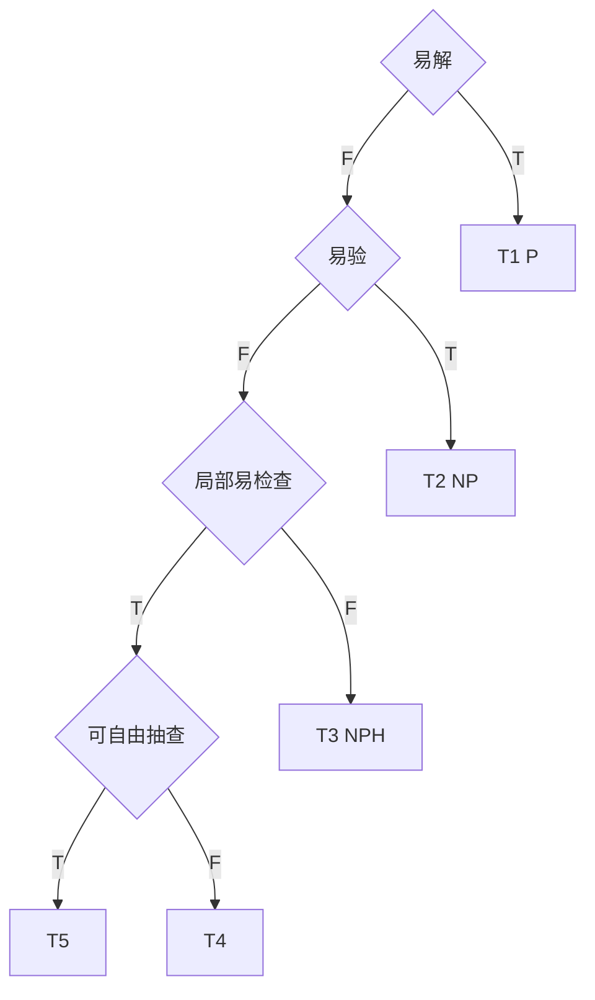

# 验证的非对称性：弱者能不能监管强者？

在任何需要“给出答案”的问题中，只要有人说：“我已经解出来了”，立刻就会出现一个更关键的问题：其他人怎么确认他是对的？如果他是错的，验证者能否在有限的成本下识别出错误？

这个问题并不只属于数学或计算机科学。它普遍存在于科研结论、工程方案、金融模型、政策预测，乃至个人判断之中。区别只在于：当问题规模变大时，**“给出一个解”与“验证这个解”之间的成本关系，会如何变化**？是否存在不对称的差异？

<aside>
⚠️

为了讨论这一问题，本文会*不严谨地*借用复杂度理论中的一些术语，例如 $P$、$NP$、$NP\text{-hard}$，但用法与标准教材并不完全一致。

- 这里的“难”与“易”，并不是严格区分“多项式时间”和“指数时间”，而是一个更直观的标准：**当问题规模翻倍时，所需的工作量是线性增长、平方增长，还是爆炸式增长？**
- 在标准复杂度理论中，$P$是$NP$的子集，然而本文中的$NP$代表的是它们的差集。
</aside>

# 背景知识：**什么是“复杂度”**

在进入具体问题之前，我们需要一个最基础的工具，用来描述“工作量随规模增长的方式”。在《 ‣ 》的开篇，我们有介绍复杂度的概念。这里是一个简短回顾。

假设一个问题的规模用 $N$ 表示，例如数字的位数、城市的数量、矩阵的维度。不同算法完成同一件事，所需步骤数可能不同。复杂度分析关心的不是具体做了多少步，而是：**当 $N$ 变大时，步骤数大致如何增长**。

为此，我们用一种记号 $O(\cdot)$，读作“big-O”。例如：

- $O(1)$ 表示不管 $N$ 多大，所需步骤都是常数，例如只看一个固定位置。
- $O(N)$ 表示步骤数与 $N$ 成正比，例如从头到尾检查一遍。
- $O(N^2)$ 表示步骤数大致与 $N^2$ 成正比，例如对每一项都要和其他所有项比较。
- $O(2^N)$ 表示指数增长，只要 $N$ 稍微变大，工作量就会失控。

在实际世界中，一个常用但并不严格的经验法则是：

**$O(N^2)$ 及以上通常被认为是“难的”，以下通常被认为是“可接受的”**。本文采用这一实践派标准。

## 常见复杂度排序

$$
O(1) <\\... < O(\log\log\log N) < O(\log\log N)< O(\log N) \\< O(N) \\< O( N \log N)\\< O(N^2)< O(N^3)< O(N^4)< ...\\< O(2^N) \\< O(N!)\\< O(N^N)< O(N^{N^N})< O(N^{N^{N^{N}}})<...
$$

## 难与易

- 在传统算法复杂度理论中，$O(2^N)$及以上的复杂度算作难，以下算作易
- 在实践派准则中，$O(N^2)$及以上的复杂度算作难，以下算作易
- 本章采用实践派准则。

## 复杂度化简规则

- 所有$+c,-c$常数可以丢掉
- 所有$c\times$系数常数可以丢掉
- 所有低阶项可以丢掉
- 在指数上的常数不能丢掉：$N^c$
- 在底数上的常数不能丢掉：$c^N$

# **T1问题：易解、易验（对应 $P$）**

第一类问题中，构造解本身不难，验证解也同样不难。

举一个极其简单的例子：计算 $10^{29}$。这个数等于 `1` 后面跟着 $29$ 个 `0`。给出这个答案，需要写下 $29$ 个 `0`，工作量与 $N=29$ 成正比，是 $O(N)$。验证也同样简单：只要数一数是不是 $29$ 个 `0`，同样是 $O(N)$。

<aside>
💡

$$
10^{29}=100000000000000000000000000000
$$

解要写$29$个`0`，是$O(N)$。

验要数$29$个`0`，是$O(N)$。

</aside>

在这一类问题中，“解”和“验”的复杂度是对称的。没有任何一方占据结构性优势。

# **T2问题：难解、易验（对应 $NP$）**

第二类问题出现了第一次关键的不对称：**构造解很难，但一旦有人给出一个候选解，验证却很容易**。

整数质因数分解是最直观、也最具代表性的例子之一。

$$
1333 = 31 \times 43
$$

如果你不预先知道31或43，要从 $1333$ 中找出它的因数，通常需要尝试大量可能性，工作量会随着数字大小迅速增长。但一旦有人给出 $31$ 和 $43$ 作为答案，验证只需要做一次乘法：看看$31\times43$ 是否等于 $1333$。

<aside>
💡

$$
\text{factor}(1333)
$$

---

我们从最朴素、最容易理解的办法开始。

一个完全不懂算法的人，也会自然想到这样一种方法：

- 从最小的质数 $2$ 开始
- 检查 $N$ 能不能被 $2$ 整除
- 如果不行，就试 $3$
- 再试 $5,7,11,13,\dots \sqrt{N}$  (在最坏情况下，我们需要尝试的所有可能质数除数，不会超过 $\sqrt{N}$)
- 一直试下去，直到找到一个能整除的数

这叫做**试除法**。它的工作方式非常原始，但逻辑完全透明。

---

- 你需要尝试的候选除数数量，最多是 $\sqrt{N}$
- 每一次尝试，都是一次“除法并检查余数”的操作

所以，**直接解整数分解的工作量大致是：**$O(\sqrt{N})$

这里的 $N$ 是整数的数值大小，而不是它的位数。

---

在计算机世界里，一个更自然的规模参数，其实是 **数字的位数**。

假设 $N$ 是一个有 $k$ 位的2进制整数，那么：

$$
N \approx 2^k
$$

于是：

$$
\sqrt{N} \approx 2^{k/2}
$$

这意味着：

**当数字的位数 $k$ 每增加 1，直接解所需的工作量，都会按指数方式增长。**

- 10 位数 → 需要试到 $2^5$
- 100 位数 → 需要试到 $2^{50}$
- 1000 位数 → 需要试到 $2^{500}$
- k 位数 → 复杂度为 $O(2^{k/2})=O(2^{k})$

这就是为什么整数分解在实践中被认为是“难解”的问题。

---

现在我们换一个角度。

假设有人直接告诉你：

$$
1333 = 31 \times 43
$$

你要做的不是“重新找答案”，而只是判断：**这句话是真是假？**

你只需要做两件事：

1. 检查 $31$ 和 $43$ 是否都是质数（复杂度忽略不计）
2. 计算一次乘法：
    
    $$
    31 \times 43 = ?
    $$
    

如果结果等于 $1333$，答案就成立。

---

无论 $k$ 多大，只要候选解已经给出：

- 验证只需要做 1**次乘法**
- 乘法的成本随数字位数$k$ 线性增长

因此，**验证一个给定分解是否正确，其复杂度是：$O(k)$**

和前面 $O(2^k)$ 的直接搜索相比，这是天壤之别。

---

正因为如此，整数分解长期被用于密码学系统中。

</aside>

从“如何解”的角度看，这是一个高维搜索问题；从“如何验”的角度看，只需要检查一个低维证据。这种结构性的非对称，使得“我给你一个证据，你一看就知道我对不对”成为可能。

<aside>
❓

类似这样非对称的问题还有

- 不定积分问题，可以用微分检查
- 解方程问题，可以把解代回方程检查
- ……

---

你还能想到哪些？

</aside>

# **T3问题：难解、难验（对应 $NP\text{-hard}$）**

第三类问题中，不对称性又消失了。解是难的，验同样是难的。即使有人声称“这是正确解”，验证者也无法通过检查一个短证据来确认，除非几乎重新做一遍原问题。

<aside>
💡

旅行商问题是最典型的例子。问题描述如下：给定若干城市以及所有任意两座城市之间的距离，要求找出一条路径，从某个城市出发，恰好访问每个城市一次并最终返回起点，使得总路程最短。

---

从“如何解”的角度看，最直接的方法是枚举所有可能的访问顺序，计算每条路径的长度，再取最短的那一条。城市数量为 $N$ 时，可能路径的数量大致是 $O(N!)$，这是一种极其迅猛的增长。

</aside>

关键在于“如何验”。假设有人给出一条完整路径，并声称它是最短的。验证这条路径“确实短”很容易，但验证“它是所有路径中最短的”却并不容易。你无法只看这条路径本身就确信没有另一条更短的路径存在，除非你对其他路径也进行了几乎同等规模的比较。

在这一类问题中，“正确性”本身无法被压缩成一个短证据。正确与否是一个全局性质，而非局部性质。

到此为止，这三类仍然与教科书中的直觉基本一致。

# **T4问题：难解，但错误可在固定位置被快速发现**

接下来的两类并不属于教科书中的标准分类，但在实际世界中极其重要。

考虑计算 $5^{23}$。从“如何解”的角度看，最朴素的方法需要做 $22$ 次乘法，工作量是 是$O(N-1)=O(N)$。，其中 $N$ 是指数的大小。从“如何验”的角度看，如果有人给出的结果最后一位不是 5，那么你可以立刻判定它是错的，这只需要检查一个固定位置，是 $O(1)$。

<aside>
💡

$$
5^{23}=5 \times 5\times 5\times... \neq 1192092895507812 \emph{4}
$$

---

如果最后一位不是$5$，可以$O(1)$发现错误，但是如果错误在其他位置，验还是$O(N)$。

</aside>

<aside>
ℹ️

算法学中有其他技巧可以把复杂度进一步压缩到$O(\log N)$，不过这不是本章讨论的重点。

</aside>

但如果错误发生在中间某一位，就没有巧解，验证成本又回到了 $O(N)$。因此，这一类问题的“易验性”是**位置依赖的**：只有当错误恰好落在某些预先知道的锚点上时，才能被快速否定。

这类问题并没有真正解决“验证难”的问题，只是提供了某些情况下的捷径。

<aside>
❗

第四类问题具有如下特征：解本身是难的，但如果解是错的，且错误发生在某些**事先可知的固定位置**上，那么错误可以被快速否定。

</aside>

<aside>
❓

有些时候，锚点可能本身并不是明摆着的，而是需要一点计算。如果将上题改成$3^N$，你能找到哪些“巧验”的锚点呢？

</aside>

# **T5问题：难解，但错误可被非固定局部抽查发现（交互式证明）**

<aside>
💡

**小剧场：黑帮交易**

---

两拨黑帮在码头做一笔大宗交易，货在集装箱里，总量巨大，单件真假肉眼难辨。如果按照“传统验货方法”，流程是这样的：打开每一个箱子，把每一件货都掏出来，逐一检查真伪、成色、编号。结果往往只有两种：要么验到一半天亮了，要么还没验完，警察已经到了。这是一种典型的 T1 式验证——为了“绝对确定”，你不得不把整个问题重新做一遍，验证成本与交易规模同阶。

聪明的黑帮不会这么干。他们会换一套规则：验货方不提前说明要查哪里，而是在交易现场随机点名，比如“开第三排第七个箱子”，“再来一个，左边那排随便挑”。每开一个箱子，只检查其中少量随机货物。如果货是真的，怎么抽都没问题；如果货是假的，只要假货比例不是接近于零，随机抽查迟早会撞上问题。关键不在于“验得够不够全”，而在于卖货的人永远不知道下一次你会查哪一个位置。

于是局面发生了根本性反转：造假者必须保证所有位置都经得起检查，否则迟早暴露；而验货者只需打开极少数箱子，就能把风险压到极低。这正是 T5 结构的直觉版本——验证不靠“验完”，而靠不可预测的局部提问；目标不是百分之百确认正确，而是让错误几乎不可能长期存活。在这种结构下，验者不需要更大的能力，只需要掌握“点哪里”的权力。

</aside>

第五类问题更进一步。解依然难以构造，但验证者可以通过**随机抽查若干局部位置**，在高概率下发现错误，而不依赖某个固定锚点。

一个典型例子是矩阵与向量的乘法。计算一个 $N\times N$ 的矩阵与一个向量的乘积，需要 $O(N^2)$ 的运算，是一项昂贵的工作。但如果有人给出了结果向量，验证者不必重新计算全部乘法。只要随机选择结果中的若干分量，检查对应的内积是否正确，就能以很高的概率发现错误。

这里的关键不在于“绝对验证”，而在于“概率性否定”，而且概率可以任意逼近100%：只要解是错的，错误几乎不可能在所有被抽查的位置上都侥幸躲过。

<aside>
💡

$$
\left(
\begin{array}{cccccccccc}
 6 & 5 & 4 & 0 & 3 & 3 & 8 & 3 & 0 & 9 \\
 4 & 5 & 3 & 0 & 3 & 3 & 4 & 7 & 7 & 9 \\
 1 & 2 & 9 & 4 & 0 & 4 & 1 & 1 & 6 & 5 \\
 4 & 9 & 1 & 1 & 5 & 8 & 6 & 3 & 5 & 7 \\
 8 & 3 & 0 & 0 & 1 & 5 & 9 & 6 & 8 & 7 \\
 3 & 2 & 5 & 0 & 2 & 5 & 4 & 3 & 9 & 5 \\
 2 & 3 & 3 & 5 & 0 & 7 & 3 & 3 & 4 & 2 \\
 5 & 7 & 7 & 7 & 3 & 3 & 0 & 5 & 3 & 7 \\
 2 & 3 & 3 & 5 & 4 & 3 & 0 & 3 & 3 & 8 \\
 1 & 5 & 1 & 1 & 9 & 1 & 3 & 6 & 1 & 2 \\
\end{array}
\right)

\left(
\begin{array}{c}
 0 \\
 0 \\
 2 \\
 6 \\
 0 \\
 5 \\
 4 \\
 0 \\
 4 \\
 3 \\
\end{array}
\right)
=
\left(
\begin{array}{c}
 82 \\
 92 \\
 105 \\
 113 \\
 114 \\
 102 \\
 105 \\
 104 \\
 87 \\
 35 \\
\end{array}
\right)
$$

解：矩阵乘向量是$O(N^2)$复杂度。

验：可以从结果向量中随机抽取少数个分量来验证。

---

这一类问题是前面几类的自然延伸，同时也是现实世界中极其重要、但在教科书中往往被一笔带过的一类问题。

它们具有如下结构特征：

- **直接构造解的成本很高，随问题规模快速增长**
- **验证一个给定解是否正确，不需要检查全部结构**
- **只要随机抽查少量、不固定的位置，就可以以极高概率发现错误**
- 抽查的位置不是预先固定的“锚点”，而是可以自由选择的

这一类问题的关键不在于“绝对验证”，而在于**概率性证伪**：

如果解是错的，那么错误几乎不可能在所有被抽查的位置上都恰好避开。

---

### **典型例子：矩阵乘向量**

给定：

- 一个 $N \times N$ 的矩阵 $A$
- 一个长度为 $N$ 的向量 $x$

我们希望计算：

$$
y = A x
$$

也就是说，$y$ 的第 $i$ 个分量等于：

$$
y_i = \sum_{j=1}^{N} A_{ij} x_j
$$

---

### **解视角：如果没有答案，如何“直接解”？**

为了计算 $y$：

- 你需要计算 $N$ 个分量
- 每一个分量都需要做 $N$ 次乘法和$N-1$加法

所以，总操作次数大致是（根据复杂度的规则，$-1$可以丢掉）：

$$
O(N \times (N＋N-1)) = O(N^2)
$$

这意味着：

**矩阵乘向量的直接计算复杂度是**$O(N^2)$

当 $N$ 稍微变大时，这个成本就会迅速上升：

- $N=10^3$ → 约一百万次运算
- $N=10^6$ → 约一万亿次运算

这在实践中是非常昂贵的。

---

### **验视角：如果给定一个候选解，如何验证它？**

现在我们换一个完全不同的立场。假设有人直接告诉你：“我已经算好了，这个向量 $y$ 就是 $Ax$ 的结果。”

问题变成了：**你要不要相信他？**

---

### **最笨的验证方式：重新算一遍**

最直接的想法是：“我不信你，我自己再算一遍。”但这样一来，你又重新做了一次 $O(N^2)$ 的工作。这在结构上与“直接解”没有任何区别。所以，**这不是一个巧妙的验证方法**。

---

### **一个关键观察：错误一定会在某些分量上体现出来**

如果候选解 $y$ 是错的，那么至少存在一个位置 $\exists i$，使得：

$$
y_i \neq \sum_{j=1}^{N} A_{ij} x_j
$$

也就是说，错误必然藏在某些分量里。

---

### **随机抽查一个分量需要多少工作？**

假设你随机选取一个位置 $i$，想要验证第 $i$ 个分量是否正确。

你需要做的事情是：

- 取出矩阵的第 $i$ 行
- 与向量 $x$ 做一次内积

也就是说：**验证一个随机分量的成本是 $O(N)$**

这比 $O(N^2)$ 低了一个数量级。

---

### **抽样验证的核心思想**

现在关键的问题来了：如果我只随机检查一小部分分量，而不是全部，我凭什么相信错误不会刚好被我“错过”？这正是第五类问题的核心。

---

### **错误逃逸的概率是如何下降的？**

假设候选解 $y$ 中，有一部分分量是错误的。

我们用一个比例来描述：

- 假设至少有 $\alpha N$ 个分量是错的，其中  $0 < \alpha \le 1$

这意味着：**你随机抽取一个分量，抽中的概率是 $\alpha$。**

---

### **抽查一次够不够？**

显然不够。如果你只抽查一次，即使 $\alpha=10\%$，也仍然有 $90\%$ 的概率抽到一个“恰好没错的分量”。

---

### **抽查 $k$ 次会发生什么？**

如果你独立地随机抽查 $k$ 个不同分量，那么：

- 一次没抽到错误的概率是 $(1-\alpha)$
- 连续 $k$ 次都没抽到错误的概率是 $(1-\alpha)^k$

这是一个**指数衰减**的过程。

继续增加抽查次数，逃逸概率会迅速接近 0。

---

### **那么到底要抽样多少次才“合理”？**

**只要抽查次数随 $\log N$ 增长，就足以让错误逃逸的概率随着 $N$ 迅速下降至几乎为0**

$$
\underset{N\to \infty }{\text{lim}}(1-\alpha)^{\log (N)} =0
$$

---

### **为什么 $\log N$ 是一个好的界？**

$\log N$ 的增长速度非常慢：

- $N=2^6$ $\implies$ $\log N \approx 6$
- $N=2^{12}$ $\implies$ $\log N \approx 12$

也就是说：

- 问题规模扩大一百万倍
- 抽样次数只需要增加几十次

---

### **验证的总体复杂度是多少？**

我们把所有成本合在一起：

- 每次抽样验证一个分量：$O(N)$
- 抽样次数：$O(\log N)$

所以，总验证复杂度是：

$$
O(N \log N)
$$

这比直接解的 $O(N^2)$ **低了一个数量级**。

</aside>

---

### **第五类问题的本质结构**

现在我们可以总结这一类问题的真正特点：

- **解是全局结构，构造成本高**
- **错误是局部存在的，不可能完美隐藏**
- **通过随机、非固定的局部抽查**
- **可以在远低于“重新解一遍”的成本下，以极高概率排除错误**

这不是“我一定能证明你是对的”，而是**“如果你是错的，我几乎一定能发现。”**

---

### **第五类与第四类问题的本质区别**

第四类问题中：

- 只有某些**事先已知的固定位置**可以快速检查
- 错误是否容易发现，依赖于是否“刚好落在锚点上”
- 巧验者的信心不能任意逼近100%

第五类问题中：

- **任何位置都可能成为检查点**
- 错误无法提前知道检查位置，因此无法系统性规避
- 巧验者的信心可以任意逼近100%

这是一个从“位置依赖”到“概率支配”的不同。

<aside>
ℹ️

**交互式证明：**

T5 之所以比 T4 强，是因为验证者掌握了“提问权”。这种随机性让解者无法预判。这可以引申到 AI 治理中的“交互式审计”——监管不应该是静态的检查清单，而应该是不可预测的随机提问。

</aside>

---

<aside>
❓

**验证斐波那契数列**

---

给定一个长度为 N 的整数序列：

$$
a_1, a_2, a_3, \dots, a_N
$$

某人声称它是标准斐波那契数列的前 N 项，即满足：

$$
a_1 = 1, \quad a_2 = 1
$$

并且对所有 $i \ge 3$：

$$
a_i = a_{i-1} + a_{i-2}
$$

最直接的验证方法是逐项检查所有递推关系，这属于 T1 结构：解与验同阶。这显然不是我们想要的

---

问题：

设计一种“T5”的验证机制。

</aside>

<aside>
❓

**验证多项式**

---

某人声称以下等式成立：

$$
(-9 + x)^4 + (5 + x)^6 = 22186 + 15834 x + 9861 x^2 + 2464 x^3 + 376 x^4 + 30 x^5 - x^6
$$

---

问题：

设计一种“T5”的验证机制。

</aside>

# 总览

|  | 解 | 验 |
| --- | --- | --- |
| T1：P | 易 | 易 |
| T2：NP | 难 | 易 |
| T3：NPH | 难 | 难 |
| T4 | 难 | 固定局部易验 |
| T5 | 难 | 非固定局部易验 |

<aside>
❓

为什么不存在易解难验的情况？

</aside>

# PCP定理

第五类问题所体现的结构，并不是若干巧妙算法带来的偶然便利，而是被一个严格数学定理所系统刻画过的现象。在计算复杂性理论中，这一结果被称为 **PCP 定理（Probabilistically Checkable Proofs Theorem）**。

PCP 定理的标准表述在形式上相当技术化，但其核心结论可以用一种不依赖证明细节的方式准确地说清楚：

<aside>
📐

**任何一个可以用多项式规模复杂度证明其正确性的结论（即T1和T2问题），都可以被改写成一种证明形式，使得验证者只需随机检查其中极少的一部分，就能在高概率下发现错误。**

</aside>

这里有三个关键点需要同时成立，缺一不可。

第一，这里的结论范围是“所有 NP 级别的命题（本文中的T1和T2）”，而不是某些特殊问题。换言之，这不是针对矩阵乘法或代数结构的技巧，而是一个具有全称性的结构性结果。

第二，验证者的检查是**局部的**，而且其位置是**随机选择的**。验证并不依赖某些预先固定好的关键步骤，也不需要理解完整推导过程。验证者只是在不可预测的位置提出少量一致性检查。

第三，定理保证的是一种**单边错误性质**：如果结论是正确的，那么验证总是通过；如果结论是错误的，那么无论证明者如何构造其“证明”，验证者都可以在多次随机检查后将错误逃逸的概率压到任意低。

这一点在逻辑上极其重要。PCP 定理并不是说“验证变得便宜了”，而是说：**错误不再是一种可以被精心隐藏的属性，而必然会在大量局部约束中留下痕迹。**

从这个角度看，T5类问题在验证机制上引入了一种全新的可能性：验证不需要重现求解过程，只需要确认“是否存在局部不一致”。一旦存在，这种不一致就无法在概率意义下长期逃避检查。

本文并不尝试复述 PCP 定理的形式化证明，也不区分其各种等价表述（如查询复杂度、证明长度或错误概率的常数因子）。这里真正需要强调的是它所揭示的结论：**在某些问题类别中，验证与求解在结构上并非存在非对称性，验证可以被系统性地设计成一种低成本、高置信度的证伪过程。**

这一结论，为T5类问题的存在提供了一个坚实的理论锚点。

# 解者（Solver）与验者（Verifier）的对抗博弈视角

前面的五类问题，其实可以统一为一个极其简单的对抗博弈。

我们不再抽象地谈“问题本身”，而是明确区分两个角色：

- **解者（Solver, S）**：声称“我已经得到一个正确解”
- **验者（Verifier, V）**：需要判断“这个解是否可信”

二者面对的是同一个对象，但目标完全不同。

## **博弈规则**

1. **S 的目标**
    - 以尽可能低的计算成本，构造一个能说服 V 的解。
    - 运行使用“假”解。
2. **V 的目标**
    - 以严格低于解题的计算成本，高概率判断 S 的解是不是真的。
3. **约束条件**
    - V 不能“免费知道正确答案”，只能基于候选解本身进行检查。
    - 如果V无法检查出毛病就必须相信S的解。
4. 优劣判定
    - 如果S的解是假的，但是V无法系统性检查出来——判V劣势
    - 即使V检查到了问题，但是耗费的算力与解题同数量级——仍然判V劣势。
    - 其他情况判V优势。
    - 不可能存在平局的情况。

## 博弈结果

| 问题类型 | 优势者 | 解读 |
| --- | --- | --- |
| 
T1：P
 | 
S
 | 解与验同阶，V 无结构性优势；同阶即判 V 劣势 |
| 
T2：NP
 | 
V
 | 验显著便宜于解，造假成本接近真解 |
| 
T3：NPH
 | 
S
 | 验证成本与解题同阶，V 无法压制欺骗 |
| 
T4
 | 
S
 | 固定锚点可被S策略性绕过，验证不可系统化 |
| 
T5
 | 
V
 | 随机局部抽查使错误无法隐藏，验证获得结构性优势 |

# **对 AI 大生态的启示**

前文讨论的五类问题，并不只是抽象的计算复杂度分类。它们在现实世界中，对应的是五种**完全不同的“可信性结构”**。当我们把 AI 放入这个框架中，很多看似道德、态度或管理方式的问题，会自动还原成一个更基础的问题：**这个任务在结构上，到底允许不允许低成本验证？**

在 AI 大生态中，AI 通常扮演解者（Solver, S）的角色，人类或人类设计的制度扮演验者（Verifier, V）的角色。人类如何以低成本驾驭AI就成了一门艺术；在一些不伤大雅的欺骗（类似娱乐场景）中，AI如何用最低的算力刚刚好骗过人类也成了一门艺术。

下面我们逐一讨论五类问题，在“解的视角”和“验的视角”下，各自意味着什么。

---

## **T1：易解、易验 —— 信任不是美德，而是理性选择**

在 T1 结构中，解题本身不难，验证也不难。解与验的成本处于同一数量级，而且都在实践可接受范围内。这意味着两件事。

从 AI 的解题视角看，这类任务并不会对算力形成压迫。无论是直接计算、规则推导，还是逐步生成答案，AI 都可以在相对充裕的计算预算内完成。换言之，这类任务不太存在“算不出来”的结构性压力。

从人类的验证视角看，虽然原则上可以检查，但检查本身并不比“自己做一遍”便宜多少。在这种情况下，反复验证并不会带来显著收益，反而会浪费时间和注意力。因此，**选择信任并不是放弃理性，而是成本最优的策略**。

这也是为什么在很多基础性、流程化、可重复的任务中，人类会逐渐放弃逐条检查，而转向抽样（类似T5）或完全放手。这不是对 AI 的盲信，而是因为在 T1 结构下，“不验”本身就是一种理性决策。

---

## **T2：难解、易验 —— 可规模化监督的黄金结构**

T2 是 AI 大规模应用中最理想、也最安全的一类结构。解题本身很难，需要大量搜索、试错或复杂推理；但一旦给出一个候选解，验证却极其便宜。

从 AI 的解题视角看，这类问题对算力的需求非常高。AI 可能需要尝试大量中间路径，生成许多失败样本，才能偶尔命中一个正确解。失败在这里并不是异常，而是解题过程的常态。

从人类的验证视角看，情况恰恰相反。验证不需要理解完整的解题过程，也不需要重复搜索，只需要检查一个短证据。这使得监督可以被自动化、制度化，并且可以在极低的人力成本下扩展到极大规模。

正是在这种结构下，“让 AI 不断试错，人类只负责验收”才成为可能。AI 可以犯错，而且会经常犯错；但只要验证足够便宜，错误就不会积累成系统性风险。这类结构支撑了自动编程、符号推导、形式化证明辅助等大量应用场景。

---

## **T3：难解、难验 —— 信任退化为迷信**

T3 是最危险、也最容易被误解的一类结构。这里的危险不来自于 AI 的“不认真”，而来自于一个更根本的事实：**正确性本身无法被压缩成低成本证据**。

从 AI 的解题视角看，这类问题往往已经逼近算力极限，正确解的概率本身就很低。即便 AI 给出了一个完整解，它也无法附带一个足够短、足够便宜的“正确性证明”。这不是实现问题，而是结构问题。

从人类的验证视角看，情况更加严峻。验证者即便保持最大善意，也无法在不付出与解题同阶的成本下确认正确性。一旦人类选择相信，信任就不再建立在可验证性之上，而只能建立在经验、直觉或过往成功率之上。

这正是“信任退化为迷信”的含义。在 T3 结构中，信与不信都缺乏可操作的理性标准，剩下的只是心理和社会机制。这类结构不适合承担高风险决策，因为一旦出错，事后往往也无法明确定位问题出在哪里。

<aside>
💭

假设在一个极端复杂的全球化经济体中，出现了一次前所未有的金融动荡。政府引入了一台算力超群的 AI 决策系统来制定应对策略。

### 1. 为什么它是 T3（难解、难验）？

- **解之难（Solving is Hard）：**
    
    全球经济是一个涉及数十亿决策主体、无数反馈环路的**非线性动力系统**。要找到一个“最优利率”或“最优补贴方案”来精准防止未来十年的衰退，其复杂度很高。这不仅是算力问题，更是“蝴蝶效应”带来的混沌逻辑。
    
- **验之难（Verification is Hard）：**
    
    这是 T3 的核心痛点——**不存在平行宇宙（Counterfactuals）**。
    
    当 AI 给出方案 A（比如：加息 0.25% ），人类执行了。三年后经济好转了，请问：
    
    - 是 A 方案奏效了？
    - 还是经济系统自身的周期性修复？
    - 或者是某些 AI 没预料到的随机变量（如一场意外的技术革命）抵消了 A 方案的负面影响？

在 T2 问题（如质因数分解）中，我们有一个简单的等式可以瞬间判定真伪；但在 T3 类的社会工程中，**验证一个结论是否正确，几乎需要重新运行一遍宇宙。**

### 2. 信任如何退化为“迷信”？

由于验证成本高到不可接受，人类的心理机制会发生一种危险的偏移：**从“逻辑验证”转向“偶像崇拜”。**

- **算力崇拜：** 因为人类无法理解 AI 方案背后的超高维逻辑，我们便产生一种直觉——“它动用了万亿参数，思考了我们无法想象的维度，它一定是对的。”
- **因果倒置：** 如果结果是好的，AI 就被封神；如果结果是坏的，我们会认为“如果没有 AI 方案，情况可能会更糟”。这种**不可证伪性**正是迷信的典型特征。
- **仪式化决策：** 决策者不再关注方案本身的合理性，而是关注决策流程是否咨询了最先进的 AI。只要咨询了 AI，决策者就获得了“免责声明”。

**论点强化：** 在 T3 结构下，AI 从“工具”变成了“祭司”。由于没人能证明它是错的，它的每一条输出都成了不可质疑的谕令。这种信任不是基于理解，而是基于对“高维复杂性”的敬畏，这与古代人类面对雷电与星象时的心理结构如出一辙。

---

### 3. 学术补全：AI 治理的“中世纪化”风险

**如果我们将人类生存的终极问题（如气候治理、资源分配、冲突调停）全盘托付给无法提供“短证据”的 AI，我们实际上正在亲手开启一个“信息中世纪”。** 在那个时代，真理不再产生于实验室的验证，而产生于那个没人能看懂的黑盒“预言机”。

</aside>

---

## **T4：难解、固定局部可验 —— “看起来合理”的结构性陷阱**

T4 是更需要警惕的一类结构，因为它在表面上**最像“已经被解决的问题”**。

从解题视角看，T4 与 T3 并无本质区别：解仍然很难，算力压力依然存在。AI 很可能无法在给定预算内找到真正正确的全局解。

从验证视角看，T4 引入了一种诱人的错觉：在某些固定位置、固定指标或固定样式上，错误可以被快速发现。这使得验证者产生一种安全感幻觉，认为“至少有办法抓错”。

问题在于，这种验证是**位置固定的**。检查点是预先已知的，或者可以被推断出来的。一旦解题系统意识到哪些位置会被重点关注，它就可以在不真正解决问题的情况下，优先满足这些局部约束。这并不要求解题系统“想要骗人”。只要系统的训练或使用目标中包含“在这些检查点上不出错”，而真正的全局正确性又远远超出算力可承受范围，那么在有限算力下，系统最合理、也是最稳定的行为，就是**优先满足这些可检查的“外观”约束**。

正是在这一类结构中，“看起来合理”本身会被当作优化目标。文本是否流畅、格式是否规范、结论是否符合常识、局部推导是否自洽，这些都可能成为固定锚点。一旦这些锚点被满足，验证机制就会停止，而真正困难的部分却可能完全没有被解决。

它适合生成演示性或娱乐性内容。这也是为什么 T4 结构在某些以“合理性外观”为核心目标的场景中，反而也可以是优势。这正是 T4 在现实世界中既危险、又“有用”的原因。

### **以“合理性外观”为目标，“骗过人类”就成了一种艺术**

需要特别强调的是：在很多场景中，“看起来合理”本身并不是缺陷，而是**明确、正当、甚至是唯一合理的目标**。

例如：

- 演示性内容：展示一个想法、概念或方向，重点在于是否直观、连贯、易理解，而不在于是否已经穷尽所有边界条件
- 娱乐性内容：故事、段子、设定、世界观，本身就不要求全局最优或形式化正确
    - 例如游戏和电影不需要真实，只需要看起来真实。
- 草案与原型：其目的不是“最终正确”，而是“是否值得继续投入资源”
- 头脑风暴：输出是否激发新的联想，比是否严格无误更重要

早期拍电影要用真实的炸药，演员的生命处于危险之中。用特效技术“造假”爆炸，其实是百利而无一害的“骗”。在这些场景中，T4 结构**反而是优势**。它允许系统在不付出巨大算力成本的前提下，快速生成“足够像样”的结果，从而极大地提升交互效率。从这个意义上说，**T4 并不是“AI 的缺陷”，而是一种非常高效的算力分配策略。**

### **结构性风险来自“错用”，而非“存在”**

真正的问题并不在于 T4 的存在，而在于**当使用者误把 T4 当成 T2 或 T5 来使用时**。

一旦一个本质上是 T4 结构的任务，被放入一个“默认可信”“默认正确”“可以直接据此决策”的制度环境中，风险就会迅速积累。因为：

- 验证者以为自己在“检查正确性”，实际上只是在检查外观
- 解题系统通过满足固定锚点，就能稳定通过验证
- 真正昂贵、真正决定成败的部分，从一开始就没有被系统性覆盖

在这种情况下，即使所有参与者都没有任何主观恶意，系统性误导也几乎是必然结果。这不是道德失败，而是**结构错配**。

因此，T4 结构最健康的使用方式，不是试图把它变成 T5，而是**明确承认它解决的是“看起来正确”，而不解决“正确”。**一旦这一边界被清楚地划定，T4 不但不是风险，反而会成为 AI 大生态中**极其重要、也极其高产的“娱乐”类能力来源**。

<aside>
💡

图片尺寸：636x1055px
作品名称：Charles Woodbury
创作者：约翰·辛格·萨金特 John Singer Sargent
创作年代：1921
风格：现实主义
体裁：肖像画
材质：布面油画
实际尺寸：71.4 x 41.8 cm

讨论画家约翰·辛格·萨金特如何用3条弧线就“骗”过人类，让人眼以为那3条弧线是无边框眼睛。

---

这并不是因为观者被“欺骗”，而是因为人类视觉系统的验证机制本身就是 T4 结构的。

从“解”的角度看，真实地画出一副眼镜是一件复杂得多的事情。你需要处理镜片的透视、反光、边缘厚度、与面部的遮挡关系，以及整体的空间一致性。这是一个全局性的高维问题，对画家而言代价不低。

但从“验”的角度看，人类并不会逐像素检查“这是不是一副真的眼镜”。相反，视觉系统只在几个**固定、且高度稳定的锚点**上进行快速判断：

- 眼眶附近是否出现了左右对称的弧线；
- 鼻梁处是否有连接暗示；
- 弧线的曲率是否落在“眼镜常见形态”的经验范围内。
- …

一旦这几个固定锚点被满足，验证就立刻停止，“这是眼镜”的判断便被锁定。至于镜片是否真的存在、框线是否闭合、物理结构是否自洽，已经不再被检查。

于是，“画出一副看起来像眼镜的东西”，在结构上远远低于“画出一副真实存在的眼镜”。萨金特并不是简单地省略了细节，而是**精准地命中了所有固定可验的位置**，并刻意忽略了那些对最终判断并不构成影响、却成本极高的部分。

这正是 T4 结构的核心特征：

错误（或不完整）并没有消失，只是被系统性地安置在**不会被检查的位置上**。

重要的是，在这个场景中，这种“骗”不仅是无害的，甚至是高级的。观者得到的并不是物理正确性，而是感知正确性；画作的目标也从来不是光学复原，而是视觉说服。

这说明，T4 并不是“失败的验证结构”，而是一种**当目标本身就是‘看起来合理’时，极其高效的结构**。问题从来不在于 T4 是否存在，而在于：当我们需要的是事实可信，却误用了只保证外观可信的结构时，风险才会出现。

</aside>

---

## **T5：难解、非固定局部可验 —— 概率性证伪带来的制度安全**

T5 是 T4 的关键升级，和T2一样，也是一种在“解很难”的前提下，仍然允许**可规模化可信性**的结构。

从解题视角看，T5 并没有降低解的难度。AI 仍然需要面对高维、全局的复杂结构，算力压力依旧存在。

不同之处完全来自验证视角。T5 的验证不依赖固定锚点，而依赖**不可预测的局部抽查**。任何位置都有可能成为检查锚点，解题系统无法也不应该提前知道哪些部分会被审视。

在这种结构下，即便解题系统没有能力完成全局最优解，只要它给出的答案存在系统性错误，这些错误就无法长期隐藏。验证者不需要理解整体结构，只需要不断提出局部问题，就可以把错误逃逸的概率压到任意低。

重要的是，这里获得的不是“我确信你是对的”，而是“如果你是错的，你几乎不可能长期不被发现”。这正是现代大规模系统真正需要的安全保证。

---

## 弱者能不能监管强者？

<aside>
🗣

> Think of AI as a mother whose intelligence far surpasses her child’s, but whose instincts and social pressures compel her to care for that child. That’s the only model we have of a more intelligent thing being controlled by a less intelligent thing.
人工智能就好比一位母亲，她的智慧远超自己的孩子，但她的本能和社会压力却驱使她去照顾这个孩子。这是我们目前拥有的唯一模型，展示了一个更智能的存在如何被一个不那么智能的存在所控制。[1] —— 杰弗里·辛顿
> 
</aside>

“弱者能不能监管强者”从来不是一个道德、权力问题，也不是一个意志问题，而是一个严格的结构问题。如果监管依赖于更强的算力、更全面的信息或更复杂的全局判断，那么答案是否定的：弱者不可能通过“变得更认真、更负责”来弥补结构性的能力差距。在这种结构下，监管者与被监管者站在同一复杂度层级上，监管本身就退化为重新做一遍原问题，结果只能是成本失控或形式化放弃。

真正使“弱监管强”成为可能的，不是力量对等，而是复杂度的不对称。当被监管者承担的是高成本、全局性的构造任务，而监管者只需要进行低成本、局部性的验证时，弱者才第一次获得了结构性优势。这种优势并不要求监管者理解系统的全部细节，也不要求其具备同等能力，只要求任务本身允许正确性被压缩为短证据，或允许错误在随机局部检查下以高概率暴露。在这种情况下，监管的本质不是证明强者是对的，而是让强者几乎不可能长期“错而不被发现”。

因此，弱者能否监管强者，完全取决于问题是否属于“可低成本验证”的结构。如果任务是 T3 或 T4 类型，正确性本身不可压缩，或验证依赖固定锚点，那么强者天然占优，弱者的监管只能沦为象征性仪式；但如果任务是 T2 或 T5 类型，验证成本可以被系统性压低，监管就可以被工程化、制度化和规模化，弱者不仅可以监管强者，甚至可以在博弈中占据上风。

从这个角度看，监管并不是给强者“套上更严的道德约束”，而是对任务结构本身的重新设计。只要验证机制站在弱者一侧，力量差距就不再是决定性因素；反之，只要验证与求解同阶，再强的监管意愿也无济于事。弱者能不能监管强者，答案不写在权力关系里，而写在复杂度结构里。

## **可信性不是态度问题，而是结构问题**

回到开头的那句话，在人机关系中，AI 如何以有限算力给出“看起来不错”的答案，人类如何以有限成本避免被系统性误导，这从来不是道德问题，也不是意图问题，而是结构问题。

当任务具有 T3 或 T4 的结构时，即便所有参与者都保持最大善意，欺骗或误导在统计意义上也是不可避免的；而只有当任务是 T2 或 T5 结构时，可信性才第一次成为一种可以被工程化、制度化、规模化的属性。这不是对 AI 的要求，而是对任务结构本身的要求。

| 类型 | AI是否正确 | 人类如何管理AI |
| --- | --- | --- |
| T1 | 大概率是 | 选择信任。不是不能验，而是不值得验。 |
| T2 | 大概率否 | 人类可以轻松地监工AI干活，甚至引入自动化监工，让AI不断试错，直到成功 |
| T3 | 大概率否 | 信任退化为迷信 |
| T4 | 大概率否 | AI可以找不到正确解，但是可以低成本找到骗住人类的解。存在结构性安全隐患，但是适合某些以骗住人类为最终目的的行业。 |
| T5 | 大概率否 | 同T2 |

# **如何解一个T2问题**

在 T2 结构中，难的是“找到解”，而不是“确认解”。因此，当我们站在 V 的视角，真正理性的策略不是让 V 参与求解，而是让 V 先退出求解，只保留验证权。

## 第一步，验证器

第一步不是投入算力，而是用最小的成本先做出一个验证器$V$。

验证器$V$必须满足两个条件：

- 验证复杂度显著低于求解复杂度
- 验证规则明确、可自动化、不可协商

换言之，V 的首要任务不是“变聪明”，而是“把问题改写成可低成本检查的形式”。在数学问题中，这可能是一个可快速代回的等式；在代码生成中，是一组单元测试；在优化问题中，是一套可自动计算的约束函数；在形式证明中，是一个机器可运行的形式化验证程序（例如LEAN）。

只有当验证器的复杂度被压缩到远低于求解复杂度时，问题才真正进入 T2 结构。否则，即便问题在理论上属于 T2，实践中仍可能退化为 T3。

## 第二步，Ralph loop

然后才是算力堆叠（Ralph loop[2]）。

一旦验证器完成，V 的角色基本结束，S 才开始真正的工作。此时最有效的策略不是“谨慎推理”，而是：

- 大规模并行搜索
- 允许高比例失败
- 快速生成候选解
- 每次生成立即丢给验证器筛选

在这种机制下，失败不再是成本，而是过滤过程的一部分。因为验证足够便宜，S 可以承受大量错误尝试，直到撞上一个满足约束的解。

这是一种结构性分工：

- V 负责定义“什么算对”
- S 负责“不断试，直到对”

算力可以线性堆叠，验证可以自动化执行，风险可以通过频繁检查被及时消除。因此，“如何解一个 T2 问题”的答案，并不是找到更聪明的算法，而是：先把验证器做出来，再让算力去赌博。

这正是现代自动定理证明、程序合成、强化学习搜索等系统背后的基本结构逻辑。它们并不是“天赋异禀”，而是在一个低成本验证的环境中，通过海量试错逼近正确解。

只要验证是廉价的，错误就无法积累为灾难；只要验证是自动化的，人类就不需要与 AI 在算力上对等竞争。

### 用预言机开挂

尽管如此，这个过程可能伴随着无数次的试错，仍然面临着失控。下面我们引入预言机（Oracle）的概念，让$S$扮演一个预言机，以此让问题进一步可控。

<aside>
📌

T2预言机（Oracle）的定义：

---

给定一个 T2 问题实例 $x$，T2预言机 $O$ 每次被调用时，都会输出一个候选解 $y$。这些候选解可以是随机的、粗糙的，甚至在大多数情况下是错误的。形式上可以写成：

$$
y \sim O(x)
$$

并且设通过验证器 V 的概率为：

$$
\Pr\bigl(V(y)=\text{true}\bigr)=p
$$

其中 $0<p\ll 1$。

也就是说，预言机每次“猜一个答案”，只有很小的概率 $p$ 恰好猜对。

</aside>

<aside>
💭

顾名思义，预言机就像文学作品里的预言家一样，能通过一些不明所以神神叨叨的方法得出答案，而且往往还都是对的。

</aside>

关键在于：我们并不要求预言机聪明，我们只要求验证器便宜。

假设预言机每次输出彼此独立。那么在期望意义下，找到一个通过验证的正确解所需要的尝试次数是：

$$
\mathbb{E}[\text{尝试次数}] = \frac{1}{p}
$$

如果 $p=10^{-9}$，那么期望尝试次数约为 $10^{9}$ 次。这个数字在直觉上看似巨大，但只要验证成本极低，并且尝试可以并行展开，这种结构在工程上是完全可行的。算力被用来“堆概率”，而不是“追求完美”。

这里的结构优势在于：解题难度并没有被降低，但我们不再把“找到正确路径”当作一次精密推理的结果，而是当作一次通过大量试错逼近的统计事件。只要验证器稳定、明确、不可协商，错误就会被迅速淘汰，正确解一旦出现就会被保留。

因此，“用预言机开挂”并不是让问题变简单，而是把问题彻底改写为一个概率过程：解者S负责不断生成候选，验者V负责低成本筛选。

### **如何训练一个预言机AI**

现在万事俱备，只欠东风。问题只剩下一个：预言机从哪里来？

在 AI 时代，AI 恰恰适合来充当这个预言机。

在前面的试错过程中，会自然积累两类数据（都是生成数据）：少量正确解，以及数量远远更多的错误解。错误解有没有规律？正确解有没有规律？可能完全没有规律（对应 NFL 定理），也可能存在“免费午餐”。总之，无论有没有，都必须压缩试试——因为只有压缩之后，才知道有没有结构。

如果确实存在结构，那么压缩之后就可以得到一个（不完美的）$\mathbb{K}$ 空间（参考《 ‣ 》）。这个 $\mathbb{K}$ 空间并不是答案本身，而是一个偏向“更可能正确”的表示空间。

预言机不再在所有可能性中盲目采样，而是在这个（不完美的）$\mathbb{K}$ 空间中生成候选解。于是，通过验证器的概率 $p$ 就不再是原始的随机命中率，而是被系统性抬高。

预言机不需要变得全知，只需要变得“略微偏向正确”。哪怕 $p$ 只提高一个数量级，期望尝试次数也会成比例下降。

<aside>
❓

思考题：

---

这里对生成数据的使用，是否违背《 ‣ 》？

---

提示：$V$已经包含了完整的Ground Truth。

</aside>

## 局限性

<aside>
⚠️

这个方法可以解决大多数T2类问题，然而它一定能解决*所有*T2类问题吗？不一定！

最典型、也最具启发性的反例，恰恰就是前文的整数质因数分解问题。
从结构上看，质因数分解显然是一个 T2 问题：构造解很难，但验证极其容易。只要给出两个候选因子，相乘即可瞬间确认真假。它完美满足“难解、易验”的定义。然而，当我们把它放入“预言机 + 验证器”的框架下时，事情就开始变得微妙。

回忆预言机模型：

> 我们假设存在一个候选解生成器 $O$，每次调用都会输出一个可能的分解结果 $y$，并且通过验证器 $V$ 的概率为 $p$。只要 $p > 0$ 且尝试彼此独立，期望尝试次数就是 $1/p$。
> 

理论上，只要 $p$ 不是指数级小到不可承受，这个方法就可以通过堆算力解决问题。

问题在于：对于质因数分解，$p$ 本身就是指数级小的，而且不可能被提升。虽然这一结论人类目前还没有找到相关的数学证明，但是这是目前数学界里的密码学界的共识。

正是基于这种坚如磐石的共识，现代社会才敢将万亿美元的金融体系、国家机密和个人的数字生命，全部托付给基于质数分解的加密算法。密码学家们实际上是在“复杂度的深渊”边缘建起了一座信任的堡垒。

他们笃定一件事：无论 AI 预言机（Oracle）吞噬了多少算力，学习了多少历史数据，由于素数的分布在宏观上缺乏可供神经网络捕捉的“免费午餐”，AI 永远无法构建出一个能显著提高命中率的 $\mathbb{K}$ 空间。在浩瀚的解空间里，面对一个 2048 位的整数，哪怕是参数量再大的超级 AI，也只能像一个毫无头绪的盲人，每一次猜测的正确率 $p$ 都等价于盲猜的正确率。

</aside>

<aside>
ℹ️

**降维打击：秀尔算法（Shor's Algorithm）**

---

1994 年，彼得·秀尔（Peter Shor）从理论上证明了一件事：如果你拥有一台足够大规模且稳定的量子计算机，质因数分解就不再是一个让人绝望的 T2 难题。它会被直接降维成一个多项式时间可解的问题（属于 BQP 复杂度类）。

---

但这依赖于远远尚未成熟的量子计算机技术，这一话题目前不在本书的讨论范围之内。

</aside>

# **骗的艺术：T4如何以假乱真**

以假乱真本身是一个中性词。在诈骗、学术造假、法律等场景中，它是负面的；在艺术、戏剧、游戏、特效、演示、原型设计中，它却是正面的。当以假乱真的创造力是正面的，骗就成为了一种艺术。

当任务属于 T4 结构时，$S$ 并不需要解决全局问题，只需要满足固定锚点。于是，“骗”就成为了一种对验证结构的精准利用。

## 第一，锚点识别。

$S$ 必须识别 $V$ 实际检查的是什么，而不是表面上宣称检查的是什么。很多验证机制并不会全面覆盖问题，而只关注：

- 形式是否规范
- 局部是否自洽
- 结论是否符合常识
- 是否触发关键字或模式匹配

一旦锚点被识别，$S$ 就可以集中算力满足这些位置。

## 第二，资源重分配。

当全局正确性代价极高，而局部一致性代价较低时，骗的艺术就是把有限算力优先投入“锚点区域”。

在语言生成中，这意味着优先保证语法、逻辑连接词和结论结构；在图像生成中，这意味着优先保证核心特征（例如萨金特画的“眼镜”）即可。

# 总结

当我们讨论人工智能的未来时，往往过分痴迷于提升其“求解”（Solver）的能力；然而，本章揭示了一个冷峻的真相：**人类文明的安全性并不建立在“我们比AI更聪明”之上，而是建立在“验证比求解更便宜”的结构性优势之上。**

1. **治理的本质是寻找不对称性**
如果一个任务落入 **T3（难解难验）** 的深渊，那么所谓的“对齐”或“监管”都将沦为一种心理安慰；在这种结构里，弱者无法监督强者。真正的“智慧的智慧”，在于人类作为验证者（Verifier），如何主动地将现实问题重构为 **T2（NP）** 或 **T5（PCP型）** 结构。我们不需要拥有超越AI的算力去复现每一个推理步骤，但我们需要确保：任何错误的隐藏成本，在数学逻辑上都高到AI无法承受。
2. **警惕 T4 的“拟态陷阱”**
T4 结构（固定局部易验）里，AI通过精准命中人类感知的“锚点”，以极低的成本换取了“以假乱真”的结果。理解这一点，我们就能明白：为什么在创意与娱乐行业，这种“受控的欺骗”是艺术的延伸；而在科学、法律与医疗领域，这种结构则是致命的毒药。
3. **弱者监管强者的逻辑锚点**
“弱者能否监管强者”的答案不在于权力斗争，而在于**PCP定理**所揭示的深刻启示：错误是无法被完美隐藏的。只要我们掌握了随机抽样的权杖，只要我们能强迫AI将全局逻辑展开为可局部证伪的证据，验证者就能以 $O(N \log N)$ 甚至更低的成本，压制住 $O(2^N)$ 级别的欺瞒。

---

在AI哲学的宏大叙事中，我们不应追求成为一个全知的神，而应追求成为一个精明的审稿人。智慧的本质，并不是要跑赢算法的指数级增长，而是要通过对复杂度结构的深刻洞察，让“真实”成为那个最容易被验证的“证据”。

---

# Reference

[1]“Godfather of AI envisions superintelligence with a mother’s instinct for a safe future: Powerful, smarter but unfailingly caring - The Economic Times.” Accessed: Feb. 08, 2026. [Online]. Available: [https://economictimes.indiatimes.com/magazines/panache/godfather-of-ai-geoffrey-hinton-envisions-superintelligence-with-a-mothers-instinct-powerful-smarter-but-unfailingly-caring/articleshow/123308021.cms?from=mdr](https://economictimes.indiatimes.com/magazines/panache/godfather-of-ai-geoffrey-hinton-envisions-superintelligence-with-a-mothers-instinct-powerful-smarter-but-unfailingly-caring/articleshow/123308021.cms?from=mdr)

[2] Shawn Chauhan [@shawnchauhan1], “Claude now runs unsupervised for hours and just keeps trying until it gets it right. Anthropic formalized the ‘Ralph Wiggum’ technique - named after the Simpsons character who never gives up. The loop is simple: Claude attempts the task, tries to exit, gets blocked if tests [https://t.co/CibYyF2XCc,”](https://t.co/CibYyF2XCc,%E2%80%9D) Twitter. Accessed: Jan. 16, 2026. [Online]. Available: [https://x.com/shawnchauhan1/status/2012086425639112857](https://x.com/shawnchauhan1/status/2012086425639112857)